# Slide 1: Title Slide
**Exhaustive Machine Learning Prediction of Composite Phase Change Materials (CPCMs)**
*An In-Depth Analysis of 25 Distinct AI Architectures and Ensembles*

---

# Slide 2: The Thermal Management Problem
**Why do we care?**
- Modern engineering requires massive heat dissipation for electronics and energy storage.
- Phase Change Materials (PCMs) absorb heat isothermally by melting (Latent Heat).
- **The flaw**: PCMs are thermal insulators (Thermal Conductivity ~0.2 W/m.K). They melt too slowly to be useful in rapid-response environments.

---

# Slide 3: Composite PCMs (CPCMs)
- **The Engineering Solution**: Doping PCMs with highly conductive nanoparticles.
- This creates a percolation network, multiplying Thermal Conductivity (TC) by orders of magnitude.
- **The Result**: A material that has both high latent heat capacity and high thermal conductivity.

---

# Slide 4: The Bottleneck of Discovery
- **The Combinatorial Explosion**:
  - Dozens of base PCMs & Fillers.
  - Variable weight fractions (0.1% to 20%).
  - Variable operating temperatures.
- Testing every combination in a lab is financially impossible.

---

# Slide 5: The Artificial Intelligence Solution
- We trained Machine Learning models on a comprehensive database of past experiments.
- The objective: Predict the exact Thermal Conductivity of any hypothetical CPCM instantly based solely on its compositional and thermodynamic descriptors.
- **The Scope**: Evaluated **25 unique model architectures and combinations**.

---

# Slide 6: Literature Review & Existing Approaches
- Previous studies have utilized basic Artificial Neural Networks (ANNs) for limited PCM types (e.g., only Paraffin Wax).
- **The Gap**: Most studies lack comprehensive evaluation across distinct learning paradigms (Tree vs Distance vs Meta-ensembles).
- We aim to establish which mathematical architecture is fundamentally best suited for capturing the non-linear percolation thresholds of CPCMs.

---

# Slide 7: Raw Data Collection
- Aggregated datasets from peer-reviewed experimental literature.
- **Base PCMs**: Paraffin Wax, Myristic Acid, PEG, Octadecane.
- **Nanoparticles**: SWCNT, GNPs, MWCNTs, $Al_2O_3$, Ag NPs, CuO NPs, etc.
- **Features**: Filler %, Temp, Base TC, Filler TC, NP Size (nm).

---

# Slide 8: Data Preprocessing (Cleaning)
- Raw experimental data is notoriously messy ("10-20 nm").
- **Regex Parsing**: Implemented programmatic extraction to calculate numerical averages.
- Unified column naming and standard encoding to merge multiple heterogeneous CSV files.

---

# Slide 9: Intelligent Missing Value Imputation
- Dropping rows with missing particle sizes destroys data.
- **Group-Specific Median Imputation**: 
  - An $Al_2O_3$ sample missing its size is imputed using the median size of *only* other $Al_2O_3$ samples.
- **Edge Case Logic**: If `Filler % == 0`, `Size` is strictly enforced to $0.0$.

---

# Slide 10: Feature Engineering: Thermodynamics
- Machine Learning models do not inherently know physics.
- Explicitly coded Phase State indicators based on experimental temp and melting points.
  - If `Exp_Temp` < `Melting_Temp`, `Solid = 1`, `Liquid = 0`.
  - If `Exp_Temp` > `Melting_Temp`, `Solid = 0`, `Liquid = 1`.

---

# Slide 11: The Threat of Data Leakage
- Standard `train_test_split` randomly shuffles rows. 
- Because experimental datasets contain sequences (same material tested at 5 temperatures), random splitting causes massive data leakage.

---

# Slide 12: GroupShuffleSplit to Prevent Leakage
- **Solution**: Engineered a `Group` feature by concatenating `Active_NP`, `Filler %`, and `TC-PCM`.
- We used `GroupShuffleSplit (85/15)`.
- Ensures entire experimental batches are strictly in the training or test set. The model is truly tested on unseen material combinations.

---

# Slide 13: Model Comparison Strategy
- All models were subjected to rigorous `GroupKFold` cross-validation.
- Evaluated on the exact same pristine 15% test set.
- We now present the strict theoretical and mathematical foundations of the **12 core algorithms** and the **13 ensemble combinations** deployed in this research.

---
# SVR : THEORY, ALGORITHM & TRAINING

## Core Principle

Support Vector Regression (SVR) is a regularized regression method based on the Support Vector Machine framework. SVR seeks a regression function that is **as flat as possible** while maintaining prediction errors within an ε-insensitive tolerance region. Errors smaller than ε are not penalized, whereas deviations beyond this region are penalized through slack variables.

For nonlinear regression, the **kernel trick** replaces the explicit mapping φ(x) with a kernel function K(x_i, x_j). With the RBF kernel, SVR can model complex nonlinear relationships between material descriptors and thermal conductivity without explicitly constructing the high-dimensional feature space.

## Working & Training Mechanism

Given training samples (x_i, y_i), SVR first represents the regression function as

$$f(x) = w^T\phi(x) + b$$

and defines an ε-insensitive tube around f(x). Training solves a **convex constrained quadratic optimization problem** that simultaneously minimizes model complexity ½|w|² and penalizes observations falling outside the ε-tube.

The optimization introduces two slack variables, ξ_i and ξ_i*, to quantify violations above and below the tube. The resulting dual optimization determines coefficients α_i, α_i*. Samples with non-zero dual coefficients become **support vectors** and are the observations that determine the final regression function.

## Relevance to Composite PCM

Composite-PCM thermal conductivity can exhibit nonlinear dependence on **filler concentration, temperature, and their interactions**, particularly when conductive filler networks begin to form. The RBF kernel provides a flexible nonlinear similarity measure that enables SVR to represent such relationships without assuming a predefined functional form.

Thus, SVR provides a **regularized nonlinear mapping from the selected PCM descriptors to thermal conductivity**, while C, ε, and γ control the trade-off between fitting accuracy, tolerance, and model complexity.

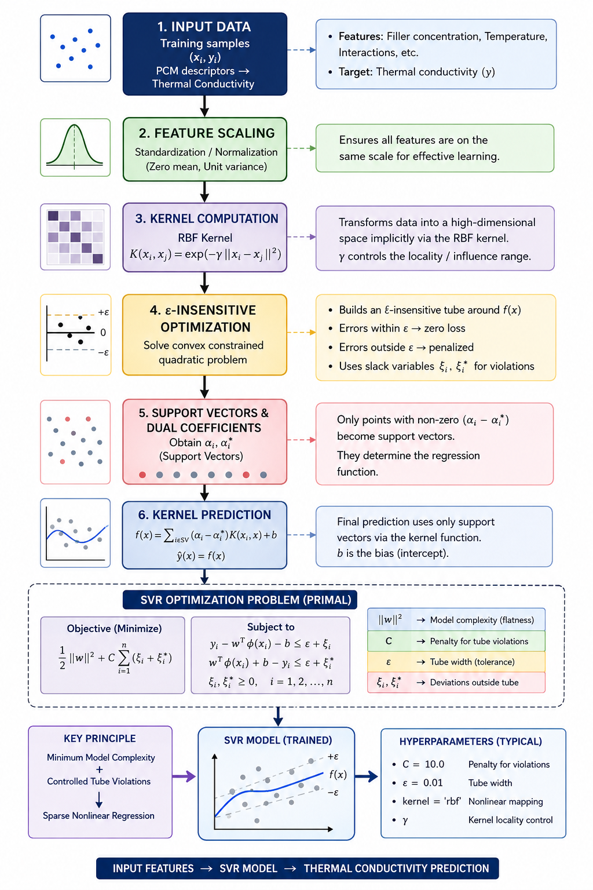

### SVR Pipeline

Input Features → Feature Scaling → RBF Kernel K(x_i, x_j) → ε-Insensitive Optimization → Support Vectors (α_i, α_i*) → Kernel Prediction ŷ(x)

| Parameter | Value Used | Role |
|:---|:---|:---|
| C | 10.0 | Controls penalty assigned to violations of the ε-tube |
| ε | 0.01 | Defines the width of the ε-insensitive zero-loss region |
| kernel | 'rbf' | Enables nonlinear regression through kernel similarity |
| γ | [use actual value] | Controls the locality/influence range of the RBF kernel |

### RBF Kernel

$$K(x_i, x_j) = \exp\left(-\gamma\|x_i - x_j\|^2\right)$$

Small γ produces broader influence and a smoother function, whereas large γ produces more localized influence and potentially greater model flexibility.

**Sources:** Smola & Schölkopf, 2004 — Statistics and Computing; Drucker et al., 1997 — Advances in Neural Information Processing Systems

---

# SVR : MATHEMATICAL FORMULATION

## Regression Function & Learning Criterion

The SVR regression function is

$$f(x) = w^T\phi(x) + b$$

and uses the ε-insensitive loss:

$$L_\epsilon(y_i, f(x_i)) = \max\left(0, |y_i - f(x_i)| - \epsilon\right)$$

Therefore, observations satisfying

$$|y_i - f(x_i)| \leq \epsilon$$

produce **zero loss**, while deviations beyond ε are penalized.

## Primal Optimization

SVR minimizes model complexity while penalizing violations of the ε-tube:

$$\min_{w,b,\xi,\xi^*} \quad \frac{1}{2}\|w\|^2 + C\sum_{i=1}^{n}(\xi_i + \xi_i^*)$$

## Constraints

$$y_i - w^T\phi(x_i) - b \leq \epsilon + \xi_i$$

$$w^T\phi(x_i) + b - y_i \leq \epsilon + \xi_i^*$$

$$\xi_i, \xi_i^* \geq 0$$

Here, ξ_i and ξ_i* measure violations above and below the ε-tube.

## Kernelized Final Prediction

Using the dual formulation and kernel trick, the explicit feature mapping φ(x) is avoided:

$$f(x) = \sum_{i \in SV} (\alpha_i - \alpha_i^*) K(x_i, x) + b$$

Only support vectors contribute to the final prediction.

## Mathematical Interpretation

- **½|w|²** → controls model complexity / flatness
- **C** → controls the penalty for tube violations
- **ε** → defines the error tolerance before penalty occurs
- **ξ_i, ξ_i*** → quantify deviations outside the tube
- **K(x_i, x)** → measures nonlinear similarity through the RBF kernel
- **α_i, α_i*** → dual coefficients determining support-vector contribution
- **b** → regression intercept

## Key SVR Principle

$$\boxed{\text{Minimum model complexity} + \text{Controlled tube violations} \rightarrow \text{Sparse nonlinear regression}}$$

**Sources:** Vapnik, 1995 — The Nature of Statistical Learning Theory; Smola & Schölkopf, 2004 — Statistics and Computing
---
# LINEAR REGRESSION : THEORY, ALGORITHM & TRAINING

### Core Principle

Linear Regression is a **parametric supervised learning method** that models the target variable as a linear combination of the input features.

For CPCM thermal conductivity, it assumes that the expected conductivity can be represented as:

$$
\hat y
=
\beta_0+
\beta_1x_1+\beta_2x_2+\cdots+\beta_px_p
$$

The model therefore provides a simple and highly interpretable **global baseline** against which nonlinear models can be evaluated.

### Working & Training Mechanism

Given a training matrix $X$ and target vector $y$, Linear Regression estimates the coefficient vector $\beta$ such that the predicted values are as close as possible to the observed targets in the **least-squares sense**.

The residual for observation $i$ is:

$$
e_i=y_i-\hat y_i
$$

Training minimizes the sum of squared residuals. When $X^TX$ is invertible, the optimal coefficients have the closed-form Ordinary Least Squares (OLS) solution:

$$
\hat\beta
=
(X^TX)^{-1}X^Ty
$$

Thus, unlike iterative models such as neural networks or boosting, ordinary Linear Regression can obtain its coefficients directly through a closed-form optimization.

### Relevance to Composite PCM

Linear Regression provides an important **reference model** for CPCM thermal-conductivity prediction. It tests whether the observed relationship between the available material descriptors and thermal conductivity can be adequately explained by a global linear relationship.

If nonlinear models substantially outperform Linear Regression, this provides evidence that the CPCM descriptor–conductivity relationship contains **nonlinearities and/or interactions** that a purely additive linear model cannot capture.

It is also highly interpretable because each coefficient represents the estimated change in the predicted target associated with a one-unit change in a feature, **holding the other included features constant**.

<!-- 

  
Feature Matrix $X$

➔

  
Assume Linear Relationship

➔

  
Minimize Squared Residuals

➔

  
Estimate $\hat\beta$

➔

  
Linear Prediction $\hat y$

 -->

| Parameter       | Value Used | Role                                                   |
| :-------------- | :--------- | :----------------------------------------------------- |
| `fit_intercept` | Default    | Determines whether an intercept $\beta_0$ is estimated |
| `copy_X`        | Default    | Controls whether the input feature matrix is copied    |
| `n_jobs`        | Default    | Controls parallel computation where applicable         |

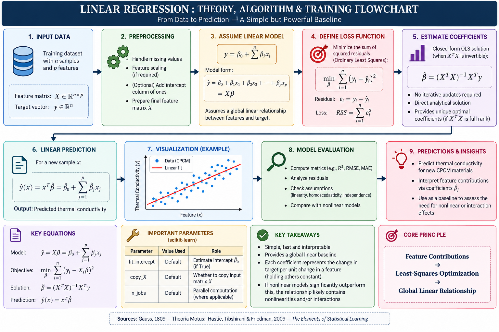

### Key Linear Regression Principle

$$
\boxed{
\text{Feature Contributions}
\rightarrow
\text{Least-Squares Optimization}
\rightarrow
\text{Global Linear Relationship}
}
$$

Source: Gauss, 1809 — Theoria Motus; Hastie, Tibshirani & Friedman, 2009 — The Elements of Statistical Learning

---

genui{"learning_viz":{"type_id":"LEAST_SQUARE_REGRESSION"}}

# LINEAR REGRESSION : MATHEMATICAL FORMULATION

### Model Equation

For $p$ input features, the linear regression model is:

$$
\boxed{
\hat y_i
=
\beta_0+
\sum_{j=1}^{p}\beta_jx_{ij}
}
$$

In matrix notation, augmenting $X$ with a column of ones:

$$
\mathbf y
=
X\beta+\epsilon
$$

where $\epsilon$ represents the residual/error term.

### Learning Criterion / Objective

Ordinary Least Squares estimates the coefficients by minimizing the sum of squared residuals:

$$
\boxed{
\hat\beta
=
\arg\min_{\beta}
\|y-X\beta\|_2^2
}
$$

Equivalently:

$$
\hat\beta
=
\arg\min_{\beta}
\sum_{i=1}^{N}
\left(
y_i-\beta_0-\sum_{j=1}^{p}\beta_jx_{ij}
\right)^2
$$

The squared-error objective penalizes large residuals more strongly than small residuals.

### Normal Equations

Taking the derivative of the least-squares objective with respect to $\beta$ and setting it to zero gives:

$$
\boxed{
X^TX\hat\beta=X^Ty
}
$$

When $X^TX$ is nonsingular:

$$
\boxed{
\hat\beta
=
(X^TX)^{-1}X^Ty
}
$$

In practical numerical implementations, the coefficients are generally obtained using stable matrix-factorization methods rather than explicitly computing the inverse.

### Geometric Interpretation

OLS can be interpreted as projecting the target vector $y$ onto the column space of $X$.

The fitted vector:

$$
\hat y=X\hat\beta
$$

is the point in the linear model space that minimizes the Euclidean distance to $y$:

$$
\boxed{
\hat y
=
\arg\min_{z\in Col(X)}
\|y-z\|_2^2
}
$$

At the optimum, the residual vector is orthogonal to the feature space:

$$
X^T(y-X\hat\beta)=0
$$

This is the mathematical condition underlying least-squares fitting.

### Residual Analysis

For observation $i$:

$$
e_i
=
y_i-\hat y_i
$$

and the total residual sum of squares is:

$$
RSS
=
\sum_{i=1}^{N}e_i^2
$$

OLS chooses the coefficients that minimize this quantity.

The coefficient of determination is often used to summarize explained variation:

$$
\boxed{
R^2
=
1-
\frac{\sum_i(y_i-\hat y_i)^2}
{\sum_i(y_i-\bar y)^2}
}
$$

However, for model comparison in the CPCM study, $R^2$ should be interpreted together with error metrics such as RMSE and MAE and, importantly, evaluated on held-out data.

### Final Prediction Equation

For a new CPCM observation:

$$
\boxed{
\hat y(x)
=
\hat\beta_0+
\sum_{j=1}^{p}
\hat\beta_jx_j
}
$$

The prediction is therefore a weighted sum of the feature values plus the estimated intercept.

### Mathematical Interpretation

* **$\beta_0$** → intercept; predicted target when all features are zero.
* **$\beta_j$** → coefficient associated with feature $j$.
* **$x_j$** → value of feature $j$.
* **$\hat y$** → predicted thermal conductivity.
* **$e_i$** → residual/error for observation $i$.
* **$RSS$** → residual sum of squares.
* **$X^TX\hat\beta=X^Ty$** → normal equations.
* **$R^2$** → proportion of target variance explained by the fitted model relative to the mean baseline.

### Key Mathematical Insight

$$
\boxed{
\hat\beta
=
\arg\min_\beta
\|y-X\beta\|_2^2
\quad\Longrightarrow\quad
X^T(y-X\hat\beta)=0
}
$$

Linear Regression finds the **best-fitting global linear approximation** by making the residual vector orthogonal to the feature space.

Its simplicity is precisely what makes it valuable in the CPCM study: it establishes whether sophisticated nonlinear algorithms are actually learning predictive structure beyond a basic linear relationship.

Source: Gauss, 1809 — Theoria Motus Corporum Coelestium; Hastie, Tibshirani & Friedman, 2009 — The Elements of Statistical Learning

---

# K-NEAREST NEIGHBORS : THEORY, ALGORITHM & TRAINING

### Core Principle

K-Nearest Neighbors (KNN) is a **non-parametric, instance-based regression algorithm** that predicts the target of a new observation from the targets of the $k$ most similar training observations.

Unlike parametric models, KNN does not learn an explicit global function during training. Instead, it **stores the training observations** and determines predictions at inference time by measuring their distance from the query point.

For regression, the standard prediction is the mean target value of the selected neighbors.

### Working & Training Mechanism

KNN is often described as a **lazy learner** because there is little explicit model fitting. The training phase primarily stores the feature matrix and target values.

For a new CPCM sample:

1. Calculate the distance between the query sample and every training observation.
2. Select the $k$ observations with the smallest distances.
3. Aggregate their thermal-conductivity values.
4. Return the resulting value as the prediction.

With distance-weighted KNN, closer observations receive greater influence.

Because distance determines similarity, **feature scaling is essential** when predictors are measured on different numerical scales.

### Relevance to Composite PCM

CPCM observations that are close in the selected feature space may correspond to materials with similar thermal-conductivity behaviour. KNN can therefore capture **local relationships and smooth neighbourhood structure** without imposing a global linear or tree-based functional form.

This makes KNN a useful complementary model to tree ensembles and parametric methods.

However, KNN can struggle when the number of features is large or when the feature space becomes sparse (**curse of dimensionality**). Its performance is also highly sensitive to the choice of $k$, distance metric, and feature scaling.

<!-- 

  
Training Data $(X,y)$

➔

  
Feature Scaling

➔

  
New CPCM Sample $x_q$

➔

  
Calculate Distances

➔

  
Select $k$ Nearest Neighbors

➔

  
Weighted / Mean Aggregation

➔

  
Predicted Conductivity $\hat y$

 -->

| Parameter     | Value Used           | Role                                                                     |
| :------------ | :------------------- | :----------------------------------------------------------------------- |
| `n_neighbors` | *[use actual value]* | Number of neighboring observations used for prediction                   |
| `weights`     | *[actual value]*     | `'uniform'` gives equal weight; `'distance'` emphasizes closer neighbors |
| `metric`      | *[actual value]*     | Distance metric used to define neighbourhood similarity                  |
| `p`           | *[actual value]*     | Power parameter for the Minkowski distance                               |

### Key KNN Principle

$$
\boxed{
\text{Feature-Space Similarity}
\rightarrow
k\text{ Nearest Observations}
\rightarrow
\text{Target Aggregation}
\rightarrow
\text{Prediction}
}
$$

Source: Cover & Hart, 1967 — Nearest Neighbor Pattern Classification, IEEE Transactions on Information Theory; Hastie, Tibshirani & Friedman, 2009 — The Elements of Statistical Learning

---

# K-NEAREST NEIGHBORS : MATHEMATICAL FORMULATION

### Distance-Based Neighbourhood

For a query point $x_q$ and training observation $x_i$, the Minkowski distance is:

$$
\boxed{
d(x_q,x_i)
=
\left(
\sum_{j=1}^{p}
|x_{qj}-x_{ij}|^r
\right)^{1/r}
}
$$

For the commonly used Euclidean distance ($r=2$):

$$
\boxed{
d(x_q,x_i)
=
\sqrt{
\sum_{j=1}^{p}
(x_{qj}-x_{ij})^2
}
}
$$

The $k$ training observations with the smallest distances form the neighbourhood:

$$
\mathcal N_k(x_q)
=
\operatorname{arg\,min}_{k}
d(x_q,x_i)
$$

### KNN Regression Objective

KNN does not optimize a global parameter vector such as $\beta$ in Linear Regression. Instead, it performs **local target estimation** at prediction time.

For uniform weighting:

$$
\boxed{
\hat y(x_q)
=
\frac{1}{k}
\sum_{i\in\mathcal N_k(x_q)}
y_i
}
$$

Thus, the prediction is simply the mean target value of the $k$ nearest observations.

### Distance-Weighted Regression

When `weights='distance'`, nearby observations receive greater importance.

A common weighting function is:

$$
w_i
=
\frac{1}{d(x_q,x_i)}
$$

leading to:

$$
\boxed{
\hat y(x_q)
=
\frac{
\sum_{i\in\mathcal N_k(x_q)}
w_i y_i
}{
\sum_{i\in\mathcal N_k(x_q)}
w_i
}
}
$$

Therefore, a training sample extremely close to the query point can exert substantially greater influence than a more distant neighbour.

### Feature Scaling

Because KNN relies directly on distances, variables with larger numerical ranges can dominate the distance calculation.

For standardization:

$$
\boxed{
x_j'
=
\frac{x_j-\mu_j}{\sigma_j}
}
$$

where $\mu_j$ and $\sigma_j$ are calculated from the **training data**.

The same transformation must then be applied to validation/test observations.

After scaling:

$$
d(x_q,x_i)
=
\sqrt{
\sum_{j=1}^{p}
(x'_{qj}-x'_{ij})^2
}
$$

so each feature contributes according to its standardized scale rather than its original measurement units.

### Effect of $k$

The neighbourhood size controls the locality of the model.

Small $k$:

$$
k\downarrow
\Rightarrow
\text{more local}
\Rightarrow
\text{lower bias, potentially higher variance}
$$

Large $k$:

$$
k\uparrow
\Rightarrow
\text{more smoothing}
\Rightarrow
\text{higher bias, potentially lower variance}
$$

Therefore, $k$ represents a fundamental **bias–variance control parameter**.

### Curse of Dimensionality

As the number of features $p$ increases, observations become increasingly sparse relative to the available feature space.

Consequently:

$$
p\uparrow
\Rightarrow
\text{Neighbour distances become less discriminative}
$$

and the distinction between the nearest and farthest observations can weaken.

This is one reason KNN can perform well in low-dimensional, meaningful feature spaces but become less effective as dimensionality increases.

### Final Prediction Equation

For uniform KNN:

$$
\boxed{
\hat y(x)
=
\frac{1}{k}
\sum_{i\in\mathcal N_k(x)}
y_i
}
$$

For distance-weighted KNN:

$$
\boxed{
\hat y(x)
=
\frac{
\sum_{i\in\mathcal N_k(x)}
w_i y_i
}{
\sum_{i\in\mathcal N_k(x)}
w_i
}
}
$$

### Mathematical Interpretation

* **$x_q$** → query/new CPCM observation.
* **$x_i$** → training observation.
* **$d(x_q,x_i)$** → distance between query and training point.
* **$k$** → number of neighbours considered.
* **$\mathcal N_k(x)$** → set of $k$ nearest observations.
* **$w_i$** → distance-based weight.
* **$p$** → number of input features.
* **$r$** → Minkowski distance order.
* **$\hat y(x)$** → predicted thermal conductivity.

### Key Mathematical Insight

$$
\boxed{
\text{Prediction}
=
\text{Local Target Average}
\quad
\text{over the nearest region of feature space}
}
$$

KNN therefore makes **no explicit global assumption about the functional form** of the CPCM conductivity relationship. Instead, it assumes that observations that are close in the properly scaled feature space tend to have similar target values.

Source: Cover & Hart, 1967 — Nearest Neighbor Pattern Classification, IEEE Transactions on Information Theory; Hastie, Tibshirani & Friedman, 2009 — The Elements of Statistical Learning

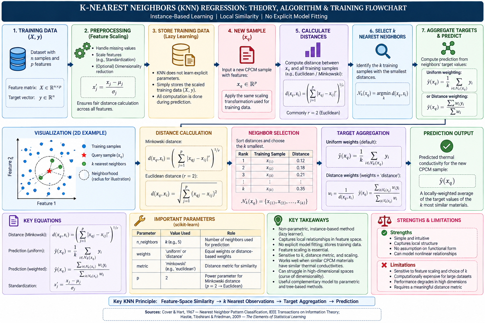

---

# LASSO REGRESSION : THEORY, ALGORITHM & TRAINING

### Core Principle

LASSO (**Least Absolute Shrinkage and Selection Operator**) extends linear regression by adding an **$L_1$ regularization penalty** to the coefficient magnitudes.

Unlike Ridge regression, which continuously shrinks coefficients toward zero, LASSO can drive some coefficients **exactly to zero**. It therefore performs both **regularization and embedded feature selection**.

The objective balances data-fitting error against model sparsity:

$$
\boxed{
\text{Squared Error}
+
\lambda\|\beta\|_1
}
$$

where $\lambda$ controls the strength of regularization.

### Working & Training Mechanism

LASSO begins with the linear regression model:

$$
\hat y=\beta_0+\sum_{j=1}^{p}\beta_jx_j
$$

and estimates the coefficients by minimizing squared prediction error subject to an $L_1$ constraint.

As $\lambda$ increases, the optimization increasingly penalizes non-zero coefficients. Some coefficients are therefore pushed exactly to zero, effectively removing their corresponding predictors from the fitted model.

Unlike ordinary Linear Regression, LASSO generally does **not** have a simple closed-form solution because of the non-differentiability of the $L_1$ penalty at zero. Numerical optimization methods such as coordinate descent are commonly used.

### Relevance to Composite PCM

CPCM datasets may contain **multiple correlated, redundant, or weakly informative descriptors**. LASSO provides an interpretable sparse baseline by identifying a subset of predictors that contributes to the linear prediction.

This is particularly useful when the research question includes:

$$
\boxed{
\text{Which available descriptors contribute to a parsimonious linear model?}
}
$$

However, with strongly correlated predictors, LASSO may arbitrarily retain one variable while shrinking another correlated variable toward zero. Therefore, a zero coefficient should not automatically be interpreted as proof that the corresponding physical variable has no underlying influence.

<!-- 

  
Feature Matrix $X$

➔

  
Linear Model

➔

  
Calculate Squared Error

➔

  
$L_1$ Penalty

➔

  
Optimize Sparse Coefficients

➔

  
Prediction + Selected Features

 -->

| Parameter       | Value Used           | Role                                      |
| :-------------- | :------------------- | :---------------------------------------- |
| `alpha`         | *[use actual value]* | Controls $L_1$ regularization strength    |
| `fit_intercept` | Default              | Determines whether an intercept is fitted |
| `max_iter`      | Default              | Maximum number of optimization iterations |
| `tol`           | Default              | Convergence tolerance for optimization    |

### Key LASSO Principle

$$
\boxed{
\text{Linear Prediction}
+
L_1\text{ Shrinkage}
\rightarrow
\text{Sparse Coefficients}
\rightarrow
\text{Embedded Feature Selection}
}
$$

Source: Tibshirani, 1996 — Regression Shrinkage and Selection via the Lasso, Journal of the Royal Statistical Society: Series B

---

# LASSO REGRESSION : MATHEMATICAL FORMULATION

### Model Equation

LASSO retains the linear regression structure:

$$
\boxed{
\hat y_i
=
\beta_0+
\sum_{j=1}^{p}
\beta_jx_{ij}
}
$$

The difference from ordinary Linear Regression is the **regularized learning criterion**.

### Learning Criterion / Objective

The LASSO coefficients are obtained by minimizing:

$$
\boxed{
\min_{\beta_0,\beta}
\left[
\frac{1}{2N}
\sum_{i=1}^{N}
(y_i-\beta_0-x_i^T\beta)^2
+
\lambda
\sum_{j=1}^{p}|\beta_j|
\right]
}
$$

The first term measures prediction error, while the second term penalizes the absolute magnitude of the coefficients.

In scikit-learn terminology, the parameter is generally written as `alpha`:

$$
\boxed{
\lambda\equiv\texttt{alpha}
}
$$

for the corresponding LASSO formulation.

### Equivalent Constrained Form

The penalized formulation can also be expressed as a constrained least-squares problem:

$$
\boxed{
\min_{\beta_0,\beta}
\sum_{i=1}^{N}
(y_i-\beta_0-x_i^T\beta)^2
}
$$

subject to

$$
\boxed{
\sum_{j=1}^{p}|\beta_j|
\leq t
}
$$

The two formulations are equivalent under an appropriate correspondence between $\lambda$ and the constraint $t$.

### Why $L_1$ Produces Sparsity

The $L_1$ penalty is:

$$
\|\beta\|_1
=
\sum_{j=1}^{p}|\beta_j|
$$

Unlike the squared $L_2$ penalty, the absolute-value function has a **non-differentiable point at $\beta_j=0$**.

The optimization therefore permits the solution to occur exactly at zero:

$$
\boxed{
\lambda\uparrow
\Rightarrow
\text{stronger shrinkage}
\Rightarrow
\text{more coefficients can become }0
}
$$

Hence:

$$
\beta_j=0
\quad\Rightarrow\quad
x_j
\text{ is excluded from the fitted linear prediction.}
$$

### Coordinate-Descent Training

A common optimization strategy for LASSO is **coordinate descent**, where one coefficient is optimized while the others are temporarily held fixed.

The resulting update has the form of a **soft-thresholding operation**:

$$
\boxed{
\beta_j
\leftarrow
\frac{
S\left(
\frac1N x_j^T(y-X_{-j}\beta_{-j}),
\lambda
\right)
}{
\frac1N x_j^Tx_j
}
}
$$

where the soft-thresholding operator is:

$$
S(z,\lambda)
=
\operatorname{sign}(z)
\max(|z|-\lambda,0)
$$

This explicitly demonstrates how coefficients can be reduced to exactly zero.

### KKT / Optimality Interpretation

At the optimum, the subgradient of the $L_1$ penalty determines whether a coefficient remains active or becomes zero.

For $\beta_j\neq0$:

$$
\frac{\partial RSS}{\partial\beta_j}
+
\lambda\,\operatorname{sign}(\beta_j)
=
0
$$

while at $\beta_j=0$, the subgradient satisfies:

$$
\frac{\partial RSS}{\partial\beta_j}
\in[-\lambda,\lambda]
$$

This interval condition is the mathematical mechanism behind **sparse solutions**.

### Effect of Regularization Strength

The limiting behaviour is useful for interpreting the model:

$$
\lambda=0
\Rightarrow
\text{Ordinary Least Squares}
$$

and as $\lambda$ becomes sufficiently large:

$$
\lambda\uparrow
\Rightarrow
\beta_j\rightarrow0
$$

for an increasing number of predictors.

Thus, LASSO creates a continuum between an unrestricted linear model and a highly sparse model.

### Final Prediction Equation

After optimization:

$$
\boxed{
\hat y(x)
=
\hat\beta_0
+
\sum_{j=1}^{p}
\hat\beta_jx_j
}
$$

Because many $\hat\beta_j$ may equal zero, this can equivalently be written over the active feature set $\mathcal A$:

$$
\boxed{
\hat y(x)
=
\hat\beta_0
+
\sum_{j\in\mathcal A}
\hat\beta_jx_j
}
$$

where:

$$
\mathcal A
=
\{j:\hat\beta_j\neq0\}
$$

### Mathematical Interpretation

* **$\beta_0$** → intercept.
* **$\beta_j$** → coefficient of feature $j$.
* **$\lambda$ / `alpha`** → $L_1$ regularization strength.
* **$|\beta|_1$** → sum of absolute coefficient magnitudes.
* **$S(z,\lambda)$** → soft-thresholding operator.
* **$\mathcal A$** → set of features retained by the fitted model.
* **$\beta_j=0$** → feature excluded from the final linear predictor.
* **$N$** → number of training observations.
* **$p$** → number of input features.

### Key Mathematical Insight

$$
\boxed{
\min_\beta
\left[
\text{Squared Error}
+
\lambda\|\beta\|_1
\right]
\quad\Longrightarrow\quad
\text{Coefficient Shrinkage + Sparsity}
}
$$

The defining distinction of LASSO is therefore:

$$
\boxed{
L_1\text{ penalty}
\rightarrow
\text{exact zeros}
\rightarrow
\text{embedded feature selection}
}
$$

This makes LASSO particularly valuable as an **interpretable sparse baseline** alongside Ridge and nonlinear CPCM models.

Source: Tibshirani, 1996 — Regression Shrinkage and Selection via the Lasso, Journal of the Royal Statistical Society: Series B; Hastie, Tibshirani & Friedman, 2009 — The Elements of Statistical Learning

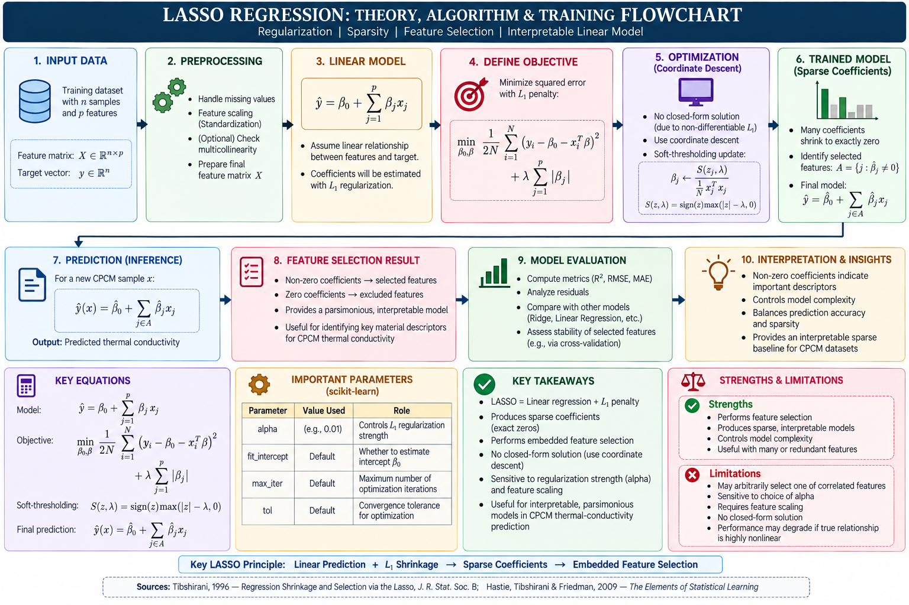

---

# ELASTIC NET : THEORY, ALGORITHM & TRAINING

### Core Principle

Elastic Net combines **L1 (LASSO)** and **L2 (Ridge)** regularization in a single linear regression framework.

* **L1 penalty** promotes **sparsity** and can drive coefficients exactly to zero.
* **L2 penalty** stabilizes coefficients and helps handle **multicollinearity**.
* The combination provides a compromise between **feature selection** and **coefficient shrinkage**.
* Particularly useful when predictors are numerous and correlated.

### Working & Training Mechanism

1. Start with the feature matrix \(X\) and target \(y\).
2. Define a linear prediction model:

   $$
   \hat{y}=X\beta+\beta_0
   $$
3. Construct the Elastic Net objective containing:

   * squared prediction error,
   * L1 penalty,
   * L2 penalty.
4. Optimize the coefficients using an iterative numerical solver, commonly **coordinate descent**.
5. The L1 component can eliminate weak/redundant descriptors, while L2 discourages excessively large coefficients.
6. The final coefficient vector is used to predict thermal conductivity.

### Relevance to Composite PCM

Elastic Net is useful when CPCM descriptors contain **correlated material, compositional, or processing variables**.

* L1 regularization provides an interpretable form of **feature selection**.
* L2 regularization improves stability when correlated descriptors compete to explain thermal conductivity.
* Compared with pure LASSO, Elastic Net can retain groups of correlated predictors rather than arbitrarily selecting only one.
* Provides a strong **regularized linear baseline** against nonlinear tree and neural-network models.

### Flowchart

**Input Features \(X\), Target \(y\)**
↓
**Linear Prediction \(X\beta+\beta_0\)**
↓
**Compute Squared Prediction Error**
↓
**Apply L1 + L2 Regularization**
↓
**Optimize Coefficients**
↓
**Sparse + Shrunk Coefficient Vector**
↓
**Predict CPCM Thermal Conductivity**

### Hyperparameters

| Parameter       |         Value Used | Role                               |
| --------------- | -----------------: | ---------------------------------- |
| `alpha`         |   `[actual value]` | Overall regularization strength    |
| `l1_ratio`      |   `[actual value]` | Controls L1/L2 mixture             |
| `fit_intercept` | `Default / actual` | Whether an intercept is fitted     |
| `max_iter`      | `Default / actual` | Maximum optimization iterations    |
| `tol`           | `Default / actual` | Optimization convergence tolerance |

> **Important:** In scikit-learn, `alpha` controls the overall regularization strength, while `l1_ratio` determines the relative contribution of L1 and L2 penalties.

### Key Elastic Net Principle

> **Elastic Net = L1 sparsity + L2 stability**
> It simultaneously performs coefficient shrinkage and can perform feature selection, making it useful for correlated predictor sets.

Source: Zou & Hastie (2005), “Regularization and Variable Selection via the Elastic Net,” Journal of the Royal Statistical Society: Series B.

---

# ELASTIC NET : MATHEMATICAL FORMULATION

### Fundamental Model Equation

For \(N\) observations and \(p\) predictors:

$$
\hat{y}_i=\beta_0+\sum_{j=1}^{p}x_{ij}\beta_j
$$

or in matrix form:

$$
\hat{\mathbf y}=\beta_0\mathbf 1+X\boldsymbol{\beta}
$$

### Learning Objective

Elastic Net minimizes the residual sum of squares together with a weighted combination of L1 and L2 penalties:

$$
\min_{\beta_0,\boldsymbol{\beta}}
\left[
\frac{1}{2N}
\sum_{i=1}^{N}
(y_i-\beta_0-x_i^T\beta)^2
+
\alpha
\left(
\rho\|\beta\|_1
+
\frac{1-\rho}{2}\|\beta\|_2^2
\right)
\right]
$$

where

$$
\|\beta\|_1=\sum_{j=1}^{p}|\beta_j|
$$

and

$$
\|\beta\|_2^2=\sum_{j=1}^{p}\beta_j^2
$$

Here, \(\alpha\) is the overall regularization strength and \(\rho\) corresponds to `l1_ratio`.

### L1–L2 Regularization

The penalty is:

$$
P(\beta)
=
\alpha
\left[
\rho\sum_{j=1}^{p}|\beta_j|
+
\frac{1-\rho}{2}\sum_{j=1}^{p}\beta_j^2
\right]
$$

Special cases:

$$
\rho=1
\Rightarrow
\text{LASSO}
$$

$$
\rho=0
\Rightarrow
\text{Ridge}
$$

Thus, Elastic Net forms a continuous family between the two regularization strategies.

### Training Mathematics

Elastic Net generally does not have a simple closed-form solution because of the **non-differentiability of the L1 term at zero**.

Coordinate descent updates one coefficient at a time while holding the others fixed.

The L1 component produces **soft-thresholding**, while the L2 component additionally shrinks the coefficient:

$$
\beta_j
\leftarrow
\frac{
S(z_j,\alpha\rho)
}{
1+\alpha(1-\rho)
}
$$

where the soft-thresholding operator is

$$
S(z,\lambda)
=
\operatorname{sign}(z)\max(|z|-\lambda,0)
$$

This explains why some coefficients can become **exactly zero**.

### Effect of Regularization

* Increasing $\alpha \rightarrow$ stronger overall shrinkage.
* Increasing `l1_ratio` $\rightarrow$ stronger sparsity pressure.
* Decreasing `l1_ratio` $\rightarrow$ stronger Ridge-like stabilization.
* $\alpha = 0 \rightarrow$ ordinary least-squares behavior.
* $0 < \text{l1\_ratio} < 1 \rightarrow$ combined L1 + L2 regularization.

### Final Prediction Equation

After optimization, the trained model predicts:

$$
\boxed{
\hat{y}
=
\beta_0+
\sum_{j=1}^{p}x_j\hat{\beta}_j
}
$$

with some \(\hat{\beta}_j=0\) potentially removed from the effective predictive model.
### Mathematical Interpretation

| Term | Meaning |
| :--- | :--- |
| $X$ | Feature/design matrix |
| $y$ | Observed thermal conductivity |
| $\beta$ | Learned regression coefficients |
| $\beta_0$ | Intercept |
| $\alpha$ | Overall regularization strength |
| $\rho$ | L1/L2 mixing parameter (`l1_ratio`) |
| $\|\beta\|_1$ | L1 penalty promoting sparsity |
| $\|\beta\|_2^2$ | L2 penalty promoting coefficient stability |
| $S(\cdot)$ | Soft-thresholding operator |
### Key Mathematical Insight

> **Elastic Net controls two different properties simultaneously:**
> **L1 → sparsity / feature selection**
> **L2 → shrinkage / stability under correlated predictors**

This makes Elastic Net particularly attractive when CPCM descriptors are **both numerous and correlated**.

Sources: Zou & Hastie (2005), “Regularization and Variable Selection via the Elastic Net”; Hastie, Tibshirani & Friedman (2009), *The Elements of Statistical Learning*.

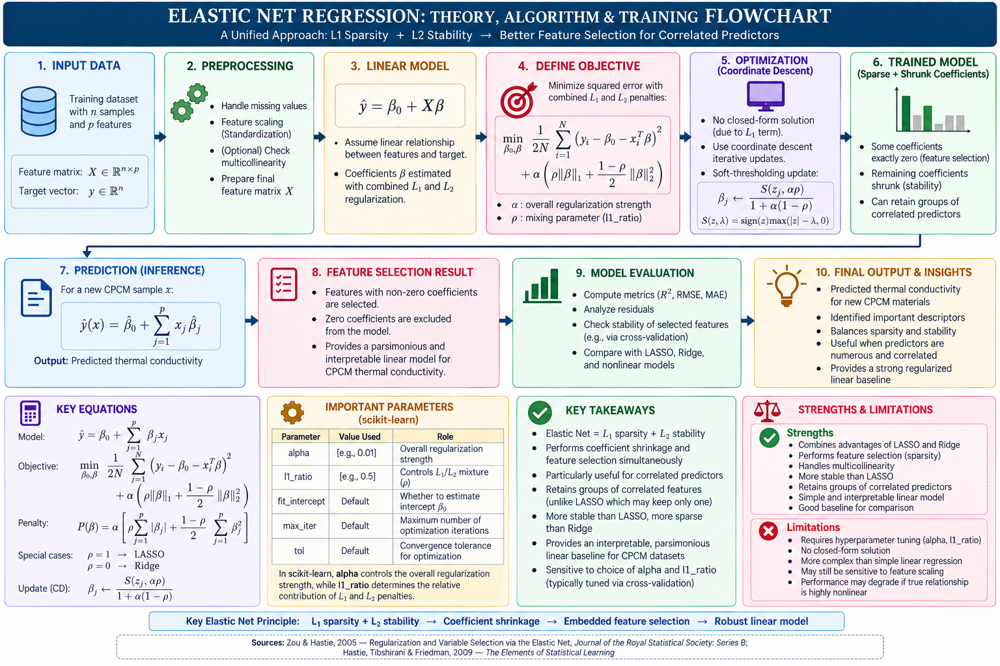

---

---
# RIDGE : THEORY, ALGORITHM & TRAINING
# RIDGE : THEORY, ALGORITHM & TRAINING

### Core Principle

Ridge regression extends ordinary least squares (OLS) by introducing an **$L_2$ regularization penalty** on the regression coefficients. Instead of minimizing prediction error alone, Ridge minimizes a combination of **residual error and coefficient magnitude**, producing a more stable solution when predictors are correlated.

The $L_2$ penalty continuously shrinks coefficient estimates toward zero without forcing them exactly to zero. This reduces coefficient variance and helps control model complexity while retaining all input descriptors.

### Working & Training Mechanism

Given the feature matrix $X$ and target vector $y$, Ridge minimizes the penalized least-squares objective. The regularization term $\lambda|\beta|_2^2$ modifies the normal equations by adding $\lambda I$ to $X^TX$.

For standard Ridge regression, the optimization has a **closed-form solution**:

$$
\hat{\beta}^{ridge}
=
(X^TX+\lambda I)^{-1}X^Ty
$$

Thus, training does not require iterative gradient-based weight updates when a closed-form solver is used. The resulting coefficients represent the regularized contribution of the input descriptors to the predicted thermal conductivity.

### Relevance to Composite PCM

Composite-PCM datasets can contain **correlated thermophysical and compositional descriptors**, which can make ordinary least-squares coefficients unstable. Ridge regularization reduces this instability by shrinking correlated-feature coefficients and preventing excessively large parameter estimates.

This provides a useful **regularized linear baseline** for determining how much predictive performance can be obtained from approximately linear relationships between the selected descriptors and thermal conductivity.

<!-- 

  
Scaled Features $X$

➔

  
Penalized Least Squares

➔

  
$X^TX+\lambda I$

➔

  
Regularized Coefficients $\hat\beta$

➔

  
Prediction $\hat y$

 -->

| Parameter | Value Used | Role                                                  |
| :-------- | :--------- | :---------------------------------------------------- |
| `alpha`   | 1.0        | Controls the strength of $L_2$ regularization         |
| `solver`  | `'auto'`   | Automatically selects an appropriate numerical solver |

### Key Ridge Principle

$$
\boxed{
\text{Prediction Error}
+
\lambda\|\beta\|_2^2
\rightarrow
\text{Stable Regularized Linear Model}
}
$$

Sources: Hoerl & Kennard, 1970 — Technometrics; Hastie, Tibshirani & Friedman, 2009 — The Elements of Statistical Learning

---

# RIDGE : MATHEMATICAL FORMULATION

### Learning Criterion / Objective

Ridge minimizes the residual sum of squares while imposing an $L_2$ penalty on the coefficient vector:

$$
\boxed{
\min_{\beta}
\left[
\|y-X\beta\|_2^2
+
\lambda\|\beta\|_2^2
\right]
}
$$

The first term measures the discrepancy between measured and predicted thermal conductivity, while the second penalizes large coefficient magnitudes.

### Regularization Mechanism

The penalty can be expressed as:

$$
\lambda\|\beta\|_2^2
=
\lambda\sum_{j=1}^{p}\beta_j^2
$$

Increasing $\lambda$ increases shrinkage:

$$
\lambda\uparrow
\Rightarrow
|\hat{\beta}_j|\downarrow
$$

Thus, Ridge trades a small amount of bias for reduced coefficient variance and improved numerical stability.

### Training Mathematics

Setting the derivative of the objective to zero gives the regularized normal equations:

$$
(X^TX+\lambda I)\hat{\beta}=X^Ty
$$

and therefore:

$$
\boxed{
\hat{\beta}^{ridge}
=
(X^TX+\lambda I)^{-1}X^Ty
}
$$

The addition of $\lambda I$ improves the conditioning of $X^TX$, particularly when predictors are strongly correlated.

### Final Prediction Equation

For a new feature vector $x$:

$$
\boxed{
\hat y(x)=x^T\hat{\beta}^{ridge}+\hat b
}
$$

If the implementation centers the data and handles the intercept separately, the intercept is estimated independently of the regularization penalty.

### Mathematical Interpretation

* **$X$** → feature/design matrix.
* **$y$** → measured thermal-conductivity vector.
* **$\beta$** → regression coefficients.
* **$\lambda$** → regularization strength; in `scikit-learn Ridge`, this corresponds to `alpha`.
* **$|\beta|_2^2$** → squared magnitude of the coefficient vector.
* **$I$** → identity matrix.
* **$X^TX$** → feature covariance/Gram structure.
* **$\hat y$** → predicted thermal conductivity.

### Key Mathematical Trade-off

$$
\boxed{
\lambda=0
\Rightarrow
\text{OLS}
}
$$

while

$$
\lambda>0
\Rightarrow
\text{Coefficient Shrinkage + Greater Stability}
$$

Sources: Hoerl & Kennard, 1970 — Technometrics; Hastie, Tibshirani & Friedman, 2009 — The Elements of Statistical Learning

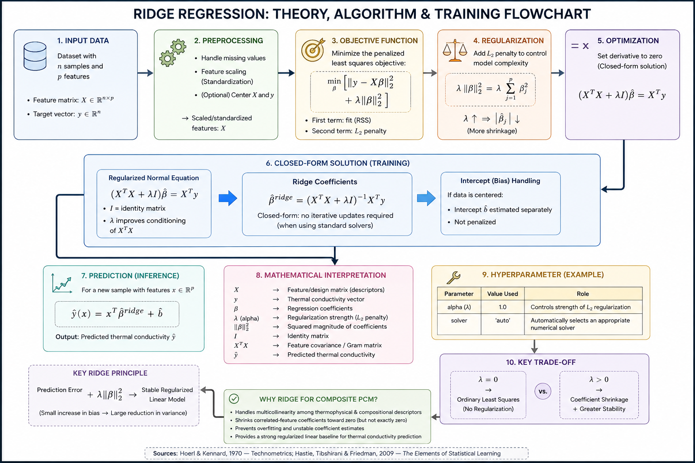

---

# PLS : THEORY, ALGORITHM & TRAINING

### Core Principle

Partial Least Squares (PLS) regression constructs a small number of **latent variables** that are linear combinations of the original predictors and are chosen to explain covariance between the predictor matrix $X$ and response matrix $Y$. Unlike PCA, which seeks directions of maximum variance in $X$ alone, PLS explicitly uses the response information during component extraction.

The resulting latent representation can reduce the effective dimensionality of correlated predictors while retaining directions that are most relevant to predicting the response.

### Working & Training Mechanism

PLS decomposes the predictor and response matrices approximately as:

$$
X=TP^T+E
$$

$$
Y=UQ^T+F
$$

where $T$ and $U$ are latent score matrices. During training, PLS sequentially extracts latent components by determining weight vectors that produce scores in $X$ with strong covariance with the corresponding response scores in $Y$.

After extracting a component, its contribution is deflated from $X$ and $Y$, and the procedure continues until the selected number of components is reached. A regression relationship is then established in the latent-variable space.

### Relevance to Composite PCM

Composite-PCM thermal-conductivity datasets can contain **correlated, redundant, and experimentally noisy descriptors**. PLS is particularly useful when several measured material properties contain overlapping information because it constructs a lower-dimensional representation using information from both $X$ and the thermal-conductivity response.

However, PLS does **not "perfectly filter out experimental noise"**; rather, the latent-variable representation can reduce dimensionality and potentially improve robustness by concentrating predictive information into a limited number of components.

<!-- 

  
Feature Matrix $X$ + Target $Y$

➔

  
Extract Weight Vector

➔

  
Latent Scores $T,U$

➔

  
Maximize $X$–$Y$ Covariance

➔

  
Deflate $X,Y$

➔

  
Latent Regression → $\hat y$

 -->

| Parameter      | Value Used | Role                                                      |
| :------------- | :--------- | :-------------------------------------------------------- |
| `n_components` | Default    | Number of latent variables/components retained            |
| `scale`        | Default    | Controls whether predictors are scaled before PLS fitting |

### Key PLS Principle

$$
\boxed{
X
\rightarrow
\text{Latent Components}
\rightarrow
\text{Covariance with }Y
\rightarrow
\hat Y
}
$$

Sources: Wold, Sjöström & Eriksson, 2001 — Chemometrics and Intelligent Laboratory Systems; Geladi & Kowalski, 1986 — Analytica Chimica Acta

---

# PLS : MATHEMATICAL FORMULATION

### Latent-Variable Decomposition

PLS represents the predictor and response matrices using latent scores:

$$
\boxed{
X=TP^T+E
}
$$

$$
\boxed{
Y=UQ^T+F
}
$$

where $T$ and $U$ contain latent scores, $P$ and $Q$ contain loadings, and $E,F$ represent residual matrices.

### Component Extraction

For each component, PLS constructs a score from the predictor matrix:

$$
t=Xw
$$

where $w$ is chosen so that the resulting latent score $t$ has strong covariance with the response.

Conceptually:

$$
\boxed{
w
\rightarrow
\text{maximize covariance between }t=Xw\text{ and }Y
}
$$

After extracting a component, the corresponding information is removed through **deflation**, and subsequent components are extracted from the remaining variation.

### Latent-Space Regression

Once the latent variables are obtained, the response is modeled using the retained components:

$$
Y\approx TB^T
$$

For a new observation $x$, the corresponding latent representation is obtained from the learned PLS transformation and used to generate the prediction.

A common compact representation is:

$$
\boxed{
\hat Y=X\hat B_{PLS}
}
$$

where $\hat B_{PLS}$ is the regression coefficient matrix reconstructed from the retained latent components.

### Important Parameter

The number of retained components, $A$, determines the dimensionality of the latent representation:

$$
A\ll p
$$

can provide dimensionality reduction when many predictors contain redundant information.

Too few components may discard predictive information, whereas too many can reduce the intended regularization benefit.

### Mathematical Interpretation

* **$X$** → predictor/feature matrix.
* **$Y$** → response matrix; here, thermal conductivity.
* **$T$** → latent score matrix for $X$.
* **$U$** → latent score matrix for $Y$.
* **$P,Q$** → loading matrices.
* **$w$** → PLS weight vector.
* **$E,F$** → residual matrices after decomposition.
* **$A$** → number of retained latent components.
* **$\hat B_{PLS}$** → final regression coefficient matrix.

### Key Difference from PCA

$$
\boxed{
\text{PCA: maximize variance in }X
}
$$

$$
\boxed{
\text{PLS: extract }X\text{ directions using covariance with }Y
}
$$

Therefore, PLS components are **supervised latent representations**, because the target information influences component extraction.

Sources: Wold, Sjöström & Eriksson, 2001 — Chemometrics and Intelligent Laboratory Systems; Geladi & Kowalski, 1986 — Analytica Chimica Acta

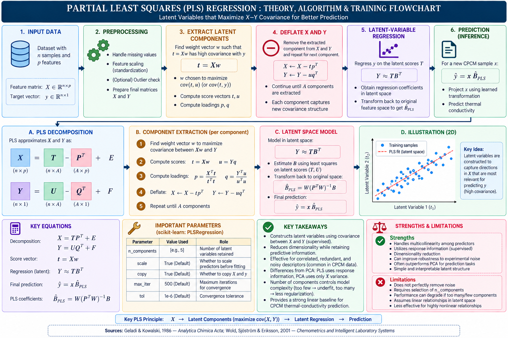

---

# CATBOOST : THEORY, ALGORITHM & TRAINING

### Core Principle

CatBoost (**Categorical Boosting**) is a gradient-boosting decision-tree algorithm designed to reduce **prediction shift and target leakage during boosting**, while providing efficient tree construction and strong regularization.

Its most distinctive mechanism is **ordered boosting**: rather than computing target-dependent statistics using the same observations on which they are evaluated, CatBoost uses ordered/permutation-based information to construct training signals. CatBoost also employs **symmetric (oblivious) trees**, where the same splitting condition is applied across all nodes at a given depth, producing balanced and computationally efficient tree structures.

Although originally designed to handle categorical variables effectively, CatBoost can also be used for **purely numerical regression**, making it applicable to tabular CPCM datasets.

### Working & Training Mechanism

For each boosting iteration, CatBoost constructs a new tree that improves the current ensemble.

A random permutation of the training observations is used to create **ordered target statistics / ordered training information**. For an observation at position $i$, target-dependent information is calculated using preceding observations in the permutation rather than directly using its own target value.

For numerical regression, the boosting process then estimates the required gradient information and constructs an **oblivious tree** by selecting a split condition that is applied consistently across the tree level.

The new tree is added to the existing ensemble, typically with shrinkage controlled by the learning rate. Regularization mechanisms such as tree depth, randomization, L2 leaf regularization, and ordered boosting help control overfitting.

### Relevance to Composite PCM

CPCM thermal-conductivity datasets are typically **structured tabular datasets** containing continuous material and experimental descriptors. CatBoost provides a strongly regularized boosting alternative to XGBoost and LightGBM.

Its ordered boosting mechanism is particularly relevant when the dataset is relatively limited, because it is designed to reduce the discrepancy between the information available during training and prediction. Its symmetric trees also provide a consistent partitioning structure that can capture nonlinear interactions among CPCM descriptors.

However, CatBoost's categorical-data advantages are less central if the present CPCM dataset contains predominantly numerical variables. In that case, its main value is as an **alternative regularized gradient-boosting architecture**.

<!-- 

  
CPCM Features $X$

➔

  
Ordered / Permuted Training Data

➔

  
Compute Gradient Information

➔

  
Select Symmetric Tree Split

➔

  
Build Oblivious Tree

➔

  
Shrink & Add to Ensemble

➔

  
Updated Prediction

 -->

| Parameter       | Value Used           | Role                                           |
| :-------------- | :------------------- | :--------------------------------------------- |
| `iterations`    | *[use actual value]* | Number of boosting iterations                  |
| `depth`         | *[use actual value]* | Depth of each symmetric tree                   |
| `learning_rate` | *[use actual value]* | Shrinkage applied to each boosting step        |
| `l2_leaf_reg`   | *[use actual value]* | $L_2$ regularization of leaf values            |
| `loss_function` | `RMSE` / *[actual]*  | Regression objective optimized during training |

### Key CatBoost Principle

$$
\boxed{
\text{Ordered Boosting}
+
\text{Symmetric Trees}
+
\text{Regularization}
\rightarrow
\text{Stable Nonlinear Regression}
}
$$

Source: Prokhorenkova et al., 2018 — CatBoost: unbiased boosting with categorical features, NeurIPS

---

# CATBOOST : MATHEMATICAL FORMULATION

### Additive Boosting Model

CatBoost represents the prediction as an additive sequence of trees:

$$
\boxed{
\hat y_i^{(t)}
=
\hat y_i^{(t-1)}
+
\eta f_t(x_i)
}
$$

After $T$ boosting iterations:

$$
\boxed{
\hat y_i
=
\hat y_0
+
\eta
\sum_{t=1}^{T}
f_t(x_i)
}
$$

where $f_t$ is the tree constructed at iteration $t$ and $\eta$ is the learning rate.

### Learning Criterion / Objective

For thermal-conductivity regression, CatBoost can minimize the Root Mean Squared Error objective. Since minimizing RMSE is equivalent to minimizing MSE with respect to the model parameters, the optimization can be expressed as:

$$
\boxed{
\mathcal L
=
\frac{1}{N}
\sum_{i=1}^{N}
(y_i-\hat y_i)^2
}
$$

CatBoost then constructs each successive tree to improve the current approximation of this objective.

### Gradient-Based Training

For a differentiable loss $L(y_i,\hat y_i)$, CatBoost uses gradient information:

$$
g_i
=
\frac{\partial L(y_i,\hat y_i)}
{\partial \hat y_i}
$$

For squared-error loss:

$$
\boxed{
g_i
=
2(\hat y_i-y_i)
}
$$

Thus, observations with larger residual errors produce larger gradient magnitudes and exert greater influence on subsequent boosting corrections.

### Symmetric / Oblivious Tree Structure

CatBoost's default tree structure is **symmetric (oblivious)**. At each depth, a single binary split condition is selected and applied to all nodes at that level.

For depth $d$, the tree therefore uses a sequence:

$$
s_1,s_2,\ldots,s_d
$$

and every observation follows the same sequence of split conditions.

A leaf can consequently be represented by a binary code:

$$
\boxed{
q(x)
=
\sum_{d=1}^{D}
2^{d-1}
I\left[s_d(x)=1\right]
}
$$

where $D$ is the tree depth.

This produces at most:

$$
2^D
$$

leaf regions for a depth-$D$ oblivious tree.

### Leaf-Value Optimization

For a leaf $j$ containing observations $I_j$, the regularized squared-error objective can be represented as:

$$
\mathcal L_j(w_j)
=
\sum_{i\in I_j}
(y_i-\hat y_i^{old}-w_j)^2
+
\lambda w_j^2
$$

Differentiating with respect to $w_j$ and setting the derivative to zero gives the regularized optimal leaf value:

$$
\boxed{
w_j^*
=
\frac{
\sum_{i\in I_j}
(y_i-\hat y_i^{old})
}{
|I_j|+\lambda
}
}
$$

Thus, the new tree contributes a regularized correction to the current prediction.

### Ordered Boosting Principle

The key idea of ordered boosting is to avoid constructing a training correction using information that directly depends on the target of the same observation.

For a permutation:

$$
\sigma(1),\sigma(2),\ldots,\sigma(N),
$$

the ordered estimate associated with observation $\sigma(i)$ is constructed using information from preceding observations:

$$
\boxed{
\text{Training information for }\sigma(i)
\leftarrow
\{\sigma(1),\ldots,\sigma(i-1)\}
}
$$

This reduces the **prediction shift** that can occur when the statistics used to construct a learner differ systematically between training and inference.

For categorical features, this mechanism is particularly important because CatBoost computes target-dependent categorical statistics using ordered information rather than directly using the observation's own target.

### Final Prediction Equation

The final CatBoost regressor is therefore:

$$
\boxed{
\hat y(x)
=
\hat y_0
+
\eta
\sum_{t=1}^{T}
f_t(x)
}
$$

Each tree contributes a small correction to the existing prediction, and the cumulative result forms the final thermal-conductivity estimate.

### Mathematical Interpretation

* **$f_t(x)$** → symmetric/oblivious regression tree at boosting iteration $t$.
* **$T$** → number of boosting iterations.
* **$\eta$** → learning rate.
* **$D$** → tree depth.
* **$w_j$** → value assigned to leaf $j$.
* **$\lambda$** → $L_2$ leaf regularization.
* **$g_i$** → gradient of the loss for observation $i$.
* **$\hat y^{old}$** → current ensemble prediction before adding the new tree.
* **Ordered boosting** → permutation-based construction designed to reduce prediction shift.
* **Oblivious tree** → same split condition applied across all nodes at each tree depth.

### Key Mathematical Insight

$$
\boxed{
\text{Current Prediction}
\rightarrow
\text{Ordered Gradient Information}
\rightarrow
\text{Symmetric Tree}
\rightarrow
\text{Regularized Leaf Values}
\rightarrow
\text{Shrinkage}
\rightarrow
\text{Updated Prediction}
}
$$

The distinguishing mathematical idea is that CatBoost combines **stage-wise gradient boosting with ordered training information and symmetric tree structures**, providing a different boosting architecture from XGBoost and LightGBM.

Source: Prokhorenkova et al., 2018 — CatBoost: Unbiased Boosting with Categorical Features, NeurIPS; Dorogush, Ershov & Gulin, 2018 — CatBoost: gradient boosting with categorical features, NeurIPS Workshop

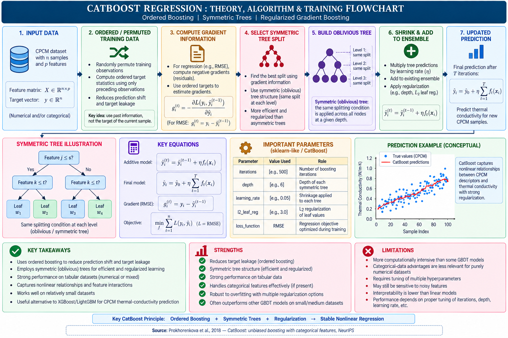

---

# NGBOOST : THEORY, ALGORITHM & TRAINING

### Core Principle

NGBoost (**Natural Gradient Boosting**) extends gradient boosting from predicting a single point estimate to learning the **parameters of a probability distribution** for the target.

Instead of directly learning:

$$
x\rightarrow \hat y,
$$

NGBoost learns:

$$
\boxed{
x\rightarrow P(y\mid x;\theta(x))
}
$$

where $\theta(x)$ represents the parameters of the predicted probability distribution, such as the **mean and standard deviation** of a Normal distribution.

The model therefore provides both a **point prediction and an estimate of predictive uncertainty**.

### Working & Training Mechanism

At each boosting iteration, NGBoost maintains a probability distribution $P(y\mid x,\theta)$ for every observation.

The current distribution parameters are evaluated using a chosen **proper scoring rule**, commonly the negative log-likelihood (NLL). The gradient of this loss is calculated with respect to the distribution parameters.

Instead of using the ordinary gradient directly, NGBoost uses the **natural gradient**, which accounts for the geometry of the probability-distribution parameter space through the Fisher information matrix.

A regression tree is then fitted to the natural-gradient direction. Its output provides a parameter update, which is added to the current distribution parameters. This process repeats for multiple boosting iterations.

<!-- 

  
Input Features $X$

➔

  
Predict Distribution Parameters $\theta(x)$

➔

  
Calculate Score / Gradient

➔

  
Natural Gradient via Fisher Information

➔

  
Fit Regression Tree

➔

  
Update Distribution Parameters

➔

  
Predict Mean + Uncertainty

 -->

| Parameter          | Value Used              | Role                                              |
| :----------------- | :---------------------- | :------------------------------------------------ |
| `Base`             | *[use actual value]*    | Base learner used to model parameter updates      |
| `Dist`             | `Normal` / *[actual]*   | Probability distribution for thermal conductivity |
| `Score`            | `LogScore` / *[actual]* | Proper scoring rule used for training             |
| `n_estimators`     | *[use actual value]*    | Number of boosting iterations                     |
| `learning_rate`    | *[use actual value]*    | Controls magnitude of each boosting update        |
| `natural_gradient` | `True` / *[actual]*     | Uses Fisher-information-scaled gradients          |

### Relevance to Composite PCM

Experimental CPCM thermal-conductivity measurements can contain substantial variability arising from material composition, processing conditions, measurement uncertainty, and heterogeneous experimental sources.

NGBoost is particularly relevant because it can model **both the expected thermal conductivity and its conditional uncertainty**:

$$
x\rightarrow
\left(
\mu(x),\sigma(x)
\right)
$$

For a Normal distribution, $\mu(x)$ provides the predicted conductivity while $\sigma(x)$ describes the model's estimated conditional spread.

This makes NGBoost useful when the research objective extends beyond **“What is the predicted conductivity?”** to **“How uncertain is that prediction?”**

However, the predicted uncertainty should be evaluated for **calibration**, not assumed to represent experimental measurement uncertainty automatically.

### Key NGBoost Principle

$$
\boxed{
\text{Gradient Boosting}
+
\text{Probability Distribution}
+
\text{Natural Gradient}
\rightarrow
\text{Probabilistic Regression}
}
$$

Source: Duan et al., 2020 — NGBoost: Natural Gradient Boosting for Probabilistic Prediction, ICML

---

# NGBOOST : MATHEMATICAL FORMULATION

### Probabilistic Prediction

Let the conditional distribution of the target be:

$$
\boxed{
Y\mid X=x
\sim
P\left(y;\theta(x)\right)
}
$$

where $\theta(x)$ is a vector of distribution parameters learned as a function of the input features.

For a Normal distribution:

$$
Y\mid X=x
\sim
\mathcal N\left(\mu(x),\sigma^2(x)\right)
$$

Therefore:

$$
\theta(x)
=
\begin{bmatrix}
\mu(x)\\
\sigma(x)
\end{bmatrix}
$$

NGBoost learns these parameters rather than directly learning only a single scalar prediction.

### Learning Criterion / Proper Scoring Rule

NGBoost trains the conditional distribution using a **proper scoring rule**. For the commonly used Log Score:

$$
\boxed{
S(y,\theta)
=
-\log p(y\mid\theta)
}
$$

Minimizing this score encourages the predicted probability distribution to assign high probability to the observed target values.

For a Normal distribution:

$$
p(y\mid\mu,\sigma)
=
\frac{1}{\sqrt{2\pi}\sigma}
\exp
\left[
-\frac{(y-\mu)^2}{2\sigma^2}
\right]
$$

Therefore, the negative log-likelihood is:

$$
\boxed{
S(y,\mu,\sigma)
=
\log\sigma
+
\frac{(y-\mu)^2}{2\sigma^2}
+
\frac12\log(2\pi)
}
$$

Unlike ordinary MSE regression, the objective therefore evaluates both the **location and scale** of the predicted distribution.

### Distribution-Parameter Gradient

Let:

$$
\rho
=
\begin{bmatrix}
\mu\\
\sigma
\end{bmatrix}
$$

The score gradient is:

$$
\nabla_\rho S
=
\begin{bmatrix}
\frac{\partial S}{\partial\mu}\\
\frac{\partial S}{\partial\sigma}
\end{bmatrix}
$$

For the Normal Log Score:

$$
\frac{\partial S}{\partial\mu}
=
-\frac{y-\mu}{\sigma^2}
$$

and

$$
\frac{\partial S}{\partial\sigma}
=
\frac1{\sigma}
-
\frac{(y-\mu)^2}{\sigma^3}
$$

These gradients describe how the distribution parameters should change to improve the current probabilistic prediction.

### Natural Gradient

Ordinary gradient descent depends on the parameterization of the distribution. NGBoost instead uses the **natural gradient**, which rescales the ordinary gradient using the inverse Fisher information matrix.

$$
\boxed{
\widetilde{\nabla}_\rho S
=
I(\rho)^{-1}
\nabla_\rho S
}
$$

where $I(\rho)$ is the Fisher information matrix:

$$
\boxed{
I(\rho)
=
\mathbb E
\left[
\nabla_\rho S
\nabla_\rho S^T
\right]
}
$$

The Fisher matrix accounts for the local geometry of the statistical distribution, making the update less dependent on the arbitrary parameterization used to represent it.

### Boosting Update

At boosting iteration $m$, a base learner $f_m(x)$ is fitted to the natural-gradient direction.

The distribution parameters are then updated as:

$$
\boxed{
\rho^{(m)}(x)
=
\rho^{(m-1)}(x)
+
\eta f_m(x)
}
$$

where $\eta$ is the learning rate.

Thus, each tree does not simply predict the final thermal conductivity. Instead, it predicts a **correction to the parameters of the conditional probability distribution**.

### Final Probabilistic Prediction

After $M$ boosting iterations:

$$
\boxed{
\rho(x)
=
\rho^{(0)}
+
\eta
\sum_{m=1}^{M}
f_m(x)
}
$$

For a Normal distribution:

$$
\boxed{
\hat Y\mid X=x
\sim
\mathcal N
\left(
\hat\mu(x),
\hat\sigma^2(x)
\right)
}
$$

The point prediction can therefore be taken as:

$$
\boxed{
\hat y(x)=\hat\mu(x)
}
$$

while $\hat\sigma(x)$ provides an estimate of the conditional predictive spread.

### Prediction Interval

For an approximately Gaussian predictive distribution, an approximate $95%$ predictive interval is:

$$
\boxed{
\hat\mu(x)
\pm
1.96\,\hat\sigma(x)
}
$$

This gives NGBoost an important advantage over conventional point-prediction models: it can provide **distributional information rather than only a single estimate**.

### Mathematical Interpretation

* **$\theta(x)$ / $\rho(x)$** → parameters of the predicted probability distribution.
* **$\mu(x)$** → predicted conditional mean.
* **$\sigma(x)$** → predicted conditional standard deviation.
* **$S(y,\theta)$** → proper scoring rule.
* **$I(\rho)$** → Fisher information matrix.
* **$\nabla_\rho S$** → ordinary score gradient.
* **$\widetilde{\nabla}_\rho S$** → natural gradient.
* **$f_m(x)$** → base learner modelling a distribution-parameter update.
* **$\eta$** → learning rate.
* **$M$** → number of boosting iterations.

### Key Mathematical Insight

$$
\boxed{
X
\rightarrow
\theta(x)
\rightarrow
\text{Score Gradient}
\rightarrow
I(\theta)^{-1}\nabla S
\rightarrow
\text{Tree Update}
\rightarrow
\theta(x)
}
$$

The central mathematical distinction is:

$$
\boxed{
\text{Standard GBM}
\rightarrow
\text{Predict Target}
}
$$

whereas:

$$
\boxed{
\text{NGBoost}
\rightarrow
\text{Predict Distribution Parameters}
}
$$

Therefore, NGBoost transforms boosting from **point estimation into probabilistic regression**, making it especially valuable when uncertainty information is important alongside thermal-conductivity prediction.

Source: Duan et al., 2020 — NGBoost: Natural Gradient Boosting for Probabilistic Prediction, Proceedings of the 37th International Conference on Machine Learning (ICML)

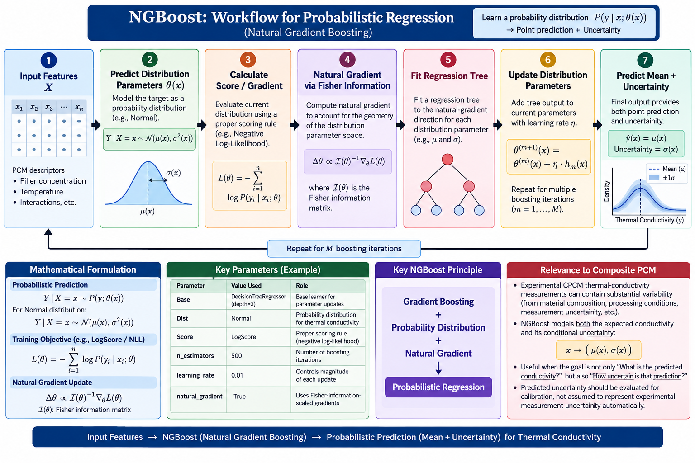

---

# HUBER REGRESSOR : THEORY, ALGORITHM & TRAINING

### Core Principle

**Huber Regression** is a robust linear regression method that combines the behavior of **squared-error loss** for small residuals with **absolute-error loss** for large residuals.

* Small residuals are treated like ordinary least squares.
* Large residuals receive a **linear rather than quadratic penalty**.
* This reduces the influence of potential outliers on the fitted regression coefficients.
* Unlike standard Linear Regression, Huber Regression is therefore **less sensitive to unusually large residuals**.

### Working & Training Mechanism

1. Input CPCM descriptors \(X\) and measured thermal conductivity \(y\).
2. Assume a linear prediction function:

   $$
   \hat y=X\beta+\beta_0
   $$
3. Calculate residuals:

   $$
   r_i=y_i-\hat y_i
   $$
4. Apply the **Huber loss** to each residual.
5. Residuals within the threshold \(\epsilon\) receive a quadratic penalty.
6. Residuals beyond \(\epsilon\) receive a linear penalty.
7. Optimize the regression coefficients and intercept using a robust optimization procedure.
8. The resulting model produces the predicted thermal conductivity.

### Relevance to Composite PCM

Experimental CPCM thermal-conductivity datasets can contain measurements with unusually large residuals because of experimental variability, heterogeneous material behavior, or measurement uncertainty.

Huber Regression can therefore provide:

* A **robust linear baseline** against which nonlinear models can be compared.
* Reduced sensitivity to observations with exceptionally large residuals.
* More stable coefficient estimation than ordinary least squares when outliers are present.
* An interpretable linear relationship between CPCM descriptors and thermal conductivity.

> Huber Regression does **not automatically identify an observation as erroneous**. It simply reduces the influence of observations whose residuals exceed the chosen threshold.

### Flowchart

**CPCM Features \(X\), Target \(y\)**
↓
**Linear Prediction \(\hat y=X\beta+\beta_0\)**
↓
**Calculate Residuals \(r_i=y_i-\hat y_i\)**
↓
**Compare \(|r_i|\) with \(\epsilon\)**
↓
**Small Residual → Quadratic Loss**
**Large Residual → Linear Loss**
↓
**Robust Optimization**
↓
**Learn \(\beta,\beta_0\)**
↓
**Predict Thermal Conductivity**

### Hyperparameters

| Parameter       |                 Value Used | Role                                                     |
| --------------- | -------------------------: | -------------------------------------------------------- |
| `epsilon`       |           `[actual value]` | Defines the transition between quadratic and linear loss |
| `alpha`         |           `[actual value]` | L2 regularization strength                               |
| `max_iter`      | `[actual value / Default]` | Maximum number of optimization iterations                |
| `tol`           | `[actual value / Default]` | Convergence tolerance                                    |
| `fit_intercept` | `[actual value / Default]` | Whether to estimate the intercept                        |

### Key Huber Regression Principle

> **Quadratic for normal residuals, linear for large residuals.**
> Huber Regression preserves the efficiency of squared-error regression near the fitted model while limiting the influence of large residuals.

Source: Huber (1964), “Robust Estimation of a Location Parameter,” <i>Annals of Mathematical Statistics</i>; Huber & Ronchetti (2009), <i>Robust Statistics</i>.

---

# HUBER REGRESSOR : MATHEMATICAL FORMULATION

### Fundamental Model Equation

Huber Regressor assumes a linear prediction function:

$$
\boxed{
\hat y_i=\beta_0+x_i^T\beta
}
$$

where \(x_i\) is the feature vector for observation \(i\).

The residual is:

$$
r_i=y_i-\hat y_i
$$

### Huber Loss Function

The central mathematical component is the **Huber loss**:

$$
\boxed{
L_\epsilon(r)=
\begin{cases}
\frac{1}{2}r^2,
& |r|\leq\epsilon\\[6pt]
\epsilon|r|-\frac{1}{2}\epsilon^2,
& |r|>\epsilon
\end{cases}
}
$$

Therefore:

**For small residuals:**

$$
|r|\leq\epsilon
\quad\Rightarrow\quad
L_\epsilon(r)=\frac12r^2
$$

The loss behaves like ordinary least squares.

**For large residuals:**

$$
|r|>\epsilon
\quad\Rightarrow\quad
L_\epsilon(r)=\epsilon|r|-\frac12\epsilon^2
$$

The loss grows only linearly instead of quadratically.

### Learning Objective

The regression parameters are estimated by minimizing the aggregate Huber loss together with L2 regularization:

$$
\boxed{
\min_{\beta_0,\beta}
\frac{1}{N}
\sum_{i=1}^{N}
L_\epsilon
\left(
y_i-\beta_0-x_i^T\beta
\right)
+
\frac{\alpha}{2}\|\beta\|_2^2
}
$$

The regularization term is:

$$
\|\beta\|_2^2
=
\sum_{j=1}^{p}\beta_j^2
$$

Thus, the objective contains two mechanisms:

$$
\text{Huber loss}
+
\text{L2 coefficient regularization}
$$

### Why Huber Loss Is Robust

For squared loss:

$$
L(r)=\frac12r^2
$$

and its derivative is:

$$
\frac{dL}{dr}=r
$$

Therefore, very large residuals generate very large gradients.

For Huber loss:

$$
\frac{dL_\epsilon}{dr}
=
\begin{cases}
r,& |r|\leq\epsilon\\[4pt]
\epsilon\,\operatorname{sign}(r),& |r|>\epsilon
\end{cases}
$$

Hence, for large residuals:

$$
\left|\frac{dL_\epsilon}{dr}\right|=\epsilon
$$

The influence of an increasingly large residual is therefore **bounded**.

### Effect of \(\epsilon\)

The threshold \(\epsilon\) determines when the loss changes from quadratic to linear.

* **Smaller \(\epsilon\)** → more observations enter the linear-loss region → stronger robustness.
* **Larger \(\epsilon\)** → more observations are treated using squared loss → behavior approaches ordinary least squares.

Conceptually:

$$
\epsilon\uparrow
\Rightarrow
\text{less robust, more OLS-like}
$$

$$
\epsilon\downarrow
\Rightarrow
\text{more robust}
$$

### Optimization Mathematics

Huber regression does not generally have the simple normal-equation solution of OLS because its objective is piecewise-defined.

Optimization is performed iteratively. A useful interpretation is **iteratively reweighted least squares (IRLS)**, where observations with large residuals receive reduced effective weight.

A corresponding weight structure can be expressed as:

$$
w_i=
\begin{cases}
1,& |r_i|\leq\epsilon\\[4pt]
\frac{\epsilon}{|r_i|},& |r_i|>\epsilon
\end{cases}
$$

Thus, a large residual receives a smaller effective weight.

> **Implementation note:** scikit-learn's `HuberRegressor` uses a numerical optimization procedure rather than exposing IRLS as the user-facing training algorithm. The weighting formulation above explains the robustness mechanism mathematically.

### Final Prediction Equation

After optimization:

$$
\boxed{
\hat y_*
=
\hat\beta_0+
x_*^T\hat\beta
}
$$

or:

$$
\boxed{
\hat y_*
=
\hat\beta_0+
\sum_{j=1}^{p}
x_{*j}\hat\beta_j
}
$$

### Mathematical Interpretation

| Symbol | Meaning |
| :--- | :--- |
| $X$ | CPCM feature matrix |
| $y$ | Observed thermal conductivity |
| $\beta$ | Learned regression coefficients |
| $\beta_0$ | Intercept |
| $r_i$ | Prediction residual |
| $\epsilon$ | Huber transition threshold |
| $L_\epsilon(r)$ | Huber loss |
| $\alpha$ | L2 regularization strength |
| $w_i$ | Effective robust weight |
### Key Mathematical Insight

> **Huber Regression limits the influence of large residuals by changing the loss growth from quadratic to linear.**
>
> $$
> \boxed{
> \text{Small error}\rightarrow OLS\text{-like}
> \qquad
> \text{Large error}\rightarrow \text{robust linear penalty}
> }
> $$

Sources: Huber (1964), “Robust Estimation of a Location Parameter,” <i>Annals of Mathematical Statistics</i>; Huber & Ronchetti (2009), <i>Robust Statistics</i>; scikit-learn documentation, <i>HuberRegressor</i>.

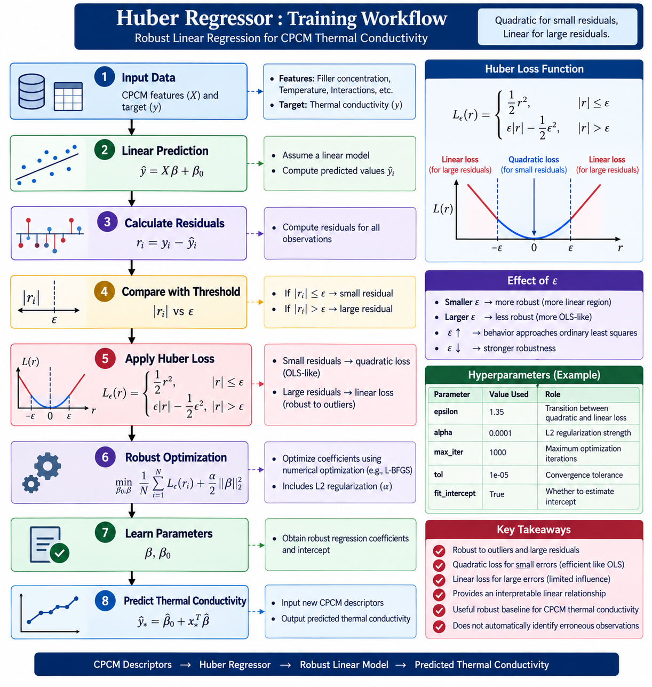

---

# GAUSSIAN PROCESS REGRESSION : THEORY, ALGORITHM & TRAINING

### Core Principle

**Gaussian Process Regression (GPR)** is a **non-parametric, probabilistic regression method** that places a Gaussian Process prior over possible functions rather than assuming a fixed functional form.

* Defines a distribution over functions using a **mean function** and **kernel/covariance function**.
* Similar input points are assumed to have correlated output values through the kernel.
* Training updates the prior using observed CPCM data to obtain a **posterior distribution over functions**.
* Prediction provides both a **mean estimate** of thermal conductivity and an associated **predictive uncertainty**.

### Working & Training Mechanism

1. Standardize/prepare the CPCM feature matrix \(X\) and thermal conductivity target \(y\).
2. Specify a mean function \(m(x)\) and kernel \(k(x,x')\).
3. Construct the covariance matrix between all training observations.
4. Add observation-noise variance to the covariance matrix.
5. Condition the Gaussian Process prior on the observed training data.
6. Optimize kernel/noise hyperparameters by maximizing the **log marginal likelihood**.
7. For a new CPCM composition, compute its covariance with the training observations.
8. Obtain the posterior predictive **mean and variance**.

### Relevance to Composite PCM

GPR is particularly attractive for CPCM datasets when the number of experimental observations is relatively limited.

* Captures **nonlinear relationships** through the kernel without explicitly specifying a nonlinear equation.
* Provides a **predictive distribution**, not merely a point estimate.
* Kernel length scales can indicate how rapidly predictions change with feature variations.
* Predictive variance can identify regions where the model is less certain and where additional experiments may be informative.
* Particularly useful when experimental measurements are expensive and uncertainty-aware prediction is valuable.

### Flowchart

**CPCM Feature Matrix \(X\), Target \(y\)**
↓
**Choose Mean + Kernel Function**
↓
**Construct Covariance Matrix \(K(X,X)\)**
↓
**Add Noise Variance**
↓
**Optimize Kernel Hyperparameters**
↓
**Maximize Log Marginal Likelihood**
↓
**Condition GP Prior on Training Data**
↓
**Posterior Predictive Distribution**
↓
**Mean Thermal Conductivity + Predictive Uncertainty**

### Hyperparameters

| Parameter              |              Value Used | Role                                                      |
| ---------------------- | ----------------------: | --------------------------------------------------------- |
| `kernel`               |       `[actual kernel]` | Defines similarity/covariance between samples             |
| `alpha` / noise level  |        `[actual value]` | Represents observation/numerical noise contribution       |
| `n_restarts_optimizer` |        `[actual value]` | Number of additional hyperparameter optimization restarts |
| `normalize_y`          |        `[actual value]` | Whether the target is normalized before GP fitting        |
| `random_state`         | `[actual value / None]` | Controls reproducibility where applicable                 |

> **Note:** The exact hyperparameters should be taken from the implemented GPR model. Do not replace `[actual value]` with assumed defaults.

### Key Gaussian Process Principle

> **GPR learns a probability distribution over functions.**
> The kernel determines how observations influence one another, while Bayesian conditioning converts the prior into a posterior that provides both **prediction and uncertainty**.

Source: Rasmussen & Williams (2006), <i>Gaussian Processes for Machine Learning</i>.

---

# GAUSSIAN PROCESS REGRESSION : MATHEMATICAL FORMULATION

### Fundamental Model

A Gaussian Process is defined as:

$$
f(x)\sim GP\left(m(x),k(x,x')\right)
$$

where

$$
m(x)=\mathbb E[f(x)]
$$

and

$$
k(x,x')=
\operatorname{Cov}\left(f(x),f(x')\right)
$$

For the training dataset:

$$
\mathbf f
=
[f(x_1),f(x_2),\ldots,f(x_N)]^T
$$

the GP prior becomes:

$$
\mathbf f\sim
\mathcal N(\mathbf m,K)
$$

where

$$
K_{ij}=k(x_i,x_j)
$$

### Observation Model

Measured thermal conductivity is modeled as:

$$
y_i=f(x_i)+\epsilon_i
$$

with Gaussian observation noise:

$$
\epsilon_i\sim\mathcal N(0,\sigma_n^2)
$$

Therefore:

$$
\boxed{
\mathbf y\sim
\mathcal N
\left(
\mathbf m,\,
K+\sigma_n^2I
\right)
}
$$

Define:

$$
K_y=K+\sigma_n^2I
$$

### Kernel Function

A common choice is the **Radial Basis Function (RBF) / Squared Exponential kernel**:

$$
\boxed{
k(x,x')
=
\sigma_f^2
\exp
\left(
-\frac{\|x-x'\|^2}{2\ell^2}
\right)
}
$$

where:

* \(\sigma_f^2\) = signal variance
* \(\ell\) = length scale
* \(\|x-x'\|\) = distance between feature vectors.

The kernel therefore determines how strongly one CPCM observation influences another.

### Hyperparameter Training

GPR commonly learns kernel hyperparameters by maximizing the **log marginal likelihood**:

$$
\boxed{
\log p(\mathbf y|X,\theta)
=
-\frac12
\mathbf y^T K_y^{-1}\mathbf y
-\frac12\log|K_y|
-\frac{N}{2}\log(2\pi)
}
$$

The three terms represent:

1. **Data fit**

   $$
   -\frac12\mathbf y^TK_y^{-1}\mathbf y
   $$

2. **Model complexity penalty**

   $$
   -\frac12\log|K_y|
   $$

3. **Normalization constant**

   $$
   -\frac{N}{2}\log(2\pi)
   $$

Thus, training balances explaining the observations against selecting an unnecessarily complex covariance structure.

### Posterior Prediction

For a new input \(x_*\), define:

$$
k_*=
[k(x_1,x_*),\ldots,k(x_N,x_*)]^T
$$

and

$$
k_{**}=k(x_*,x_*)
$$

The predictive mean is:

$$
\boxed{
\mu_*
=
m(x_*)
+
k_*^TK_y^{-1}
(\mathbf y-\mathbf m)
}
$$

The predictive latent-function variance is:

$$
\boxed{
\sigma_*^2
=
k_{**}
-
k_*^TK_y^{-1}k_*
}
$$

If observation noise is included in the prediction:

$$
\operatorname{Var}(y_*|x_*,X,y)
=
\sigma_*^2+\sigma_n^2
$$

Hence:

$$
\boxed{
y_*|x_*,X,y
\sim
\mathcal N(\mu_*,\sigma_{y_*}^2)
}
$$

| Symbol | Meaning |
| :--- | :--- |
| $X$ | Training feature matrix |
| $y$ | Observed thermal conductivity |
| $m(x)$ | GP mean function |
| $k(x,x')$ | Covariance/kernel function |
| $K$ | Training covariance matrix |
| $\sigma_n^2$ | Observation-noise variance |
| $\ell$ | Kernel length scale |
| $\sigma_f^2$ | Signal variance |
| $\mu_*$ | Predictive mean |
| $\sigma_*^2$ | Predictive uncertainty/variance |

### Computational Training Insight

Unlike ordinary linear regression, GPR requires operations involving the \(N\times N\) covariance matrix.

The computational cost is approximately:

$$
O(N^3)
$$

for exact GP training due to matrix factorization/inversion, with approximately:

$$
O(N^2)
$$

memory requirements.

This makes GPR especially attractive for **small-to-moderate experimental datasets**, but less scalable as the number of observations becomes very large.

### Key Mathematical Insight

> **GPR prediction is a kernel-weighted Bayesian update.**
> Training observations that are highly correlated with a new CPCM input contribute more strongly to its posterior prediction, while the predictive variance reflects how well the new input is supported by the observed data.

Sources: Rasmussen & Williams (2006), <i>Gaussian Processes for Machine Learning</i>; Williams & Rasmussen (1996), “Gaussian Processes for Regression,” <i>Advances in Neural Information Processing Systems</i>.

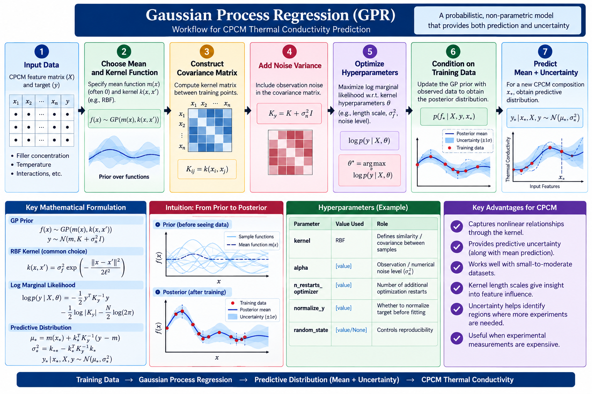

---

# DECISION TREE : THEORY, ALGORITHM & TRAINING

### Core Principle

A Decision Tree is a **non-parametric supervised learning model** that recursively partitions the feature space into regions using simple decision rules. For regression, each terminal region (leaf) is associated with a constant prediction, typically the **mean target value of the training observations assigned to that leaf**.

The tree therefore approximates a complex nonlinear relationship using a sequence of piecewise-constant functions. Unlike linear regression, it does not require a predefined linear relationship between the input descriptors and thermal conductivity.

### Working & Training Mechanism

Starting from the complete training dataset at the root node, the algorithm evaluates candidate feature–threshold pairs and selects the split that produces the greatest reduction in within-node squared error. The resulting child nodes are then **recursively split** using the same criterion.

For regression with the `squared_error` criterion, node impurity is measured using the mean squared deviation of target values from their node mean. Splitting continues according to the stopping conditions until the specified tree constraints are reached. With `max_depth=None`, the tree is allowed to continue growing until other stopping conditions are encountered.

At each terminal leaf, the model stores the mean target value of the observations reaching that leaf. Prediction is therefore obtained by routing a new observation through the learned decision rules until it reaches a terminal region.

### Relevance to Composite PCM

Composite-PCM thermal conductivity may exhibit **nonlinear and threshold-dependent behavior** as filler concentration, temperature, particle characteristics, or other descriptors change. Decision Trees can represent such behavior through hierarchical threshold rules without requiring a predefined functional form.

For example, if thermal conductivity changes substantially beyond a particular filler concentration, the tree can create a split near that region and assign different predictions to the resulting feature-space regions.

However, a single unrestricted tree can become highly complex and sensitive to the training data. Therefore, its performance should be evaluated carefully against regularized and ensemble tree methods.

  
Training Data

➔

  
Evaluate Feature–Threshold Splits

➔

  
Calculate Squared-Error Reduction

➔

  
Select Best Split

➔

  
Recursive Partitioning

➔

  
Leaf Mean → Prediction

| Parameter   | Value Used        | Role                                                                             |
| :---------- | :---------------- | :------------------------------------------------------------------------------- |
| `max_depth` | None              | Maximum tree depth; `None` allows expansion subject to other stopping conditions |
| `criterion` | `'squared_error'` | Measures regression node impurity using squared error                            |

### Key Decision-Tree Principle

$$
\boxed{
\text{Recursive Feature–Threshold Splitting}
\rightarrow
\text{Homogeneous Leaf Regions}
\rightarrow
\text{Piecewise-Constant Prediction}
}
$$

Sources: Breiman et al., 1984 — Classification and Regression Trees; Loh, 2011 — WIREs Data Mining and Knowledge Discovery

---

# DECISION TREE : MATHEMATICAL FORMULATION

### Node Prediction & Impurity

For a node $m$ containing $N_m$ observations, the optimal constant prediction is the mean target:

$$
\boxed{
\hat c_m
=
\frac{1}{N_m}
\sum_{i\in R_m}y_i
}
$$

The squared-error impurity of the node is:

$$
I(m)
=
\frac{1}{N_m}
\sum_{i\in R_m}
(y_i-\hat c_m)^2
$$

where $R_m$ denotes the observations assigned to node $m$.

### Split Selection Criterion

For a candidate split $\theta=(j,t)$, feature $j$ is divided at threshold $t$ into left and right regions:

$$
R_L(\theta)=\{x:x_j\leq t\}
$$

$$
R_R(\theta)=\{x:x_j>t\}
$$

The selected split minimizes the weighted child-node impurity:

$$
\boxed{
\theta^*
=
\arg\min_{\theta}
\left[
\frac{N_L}{N_m}I(L)
+
\frac{N_R}{N_m}I(R)
\right]
}
$$

Equivalently, the algorithm can maximize the impurity reduction:

$$
\boxed{
\Delta I
=
I(m)
-
\frac{N_L}{N_m}I(L)
-
\frac{N_R}{N_m}I(R)
}
$$

The best split is the one producing the largest $\Delta I$.

### Recursive Training

After selecting $\theta^*$, the parent region is divided:

$$
R_m
\rightarrow
R_L\cup R_R
$$

The same optimization is then applied recursively to the child nodes until the stopping conditions are satisfied.

### Final Prediction Equation

A trained regression tree partitions the feature space into terminal regions $R_1,\ldots,R_M$. For a new observation $x$:

$$
\boxed{
\hat f(x)
=
\sum_{m=1}^{M}
\hat c_m
I(x\in R_m)
}
$$

Because exactly one terminal region contains $x$:

$$
\hat f(x)=\hat c_m
\qquad
\text{if }x\in R_m
$$

Thus, the prediction is the **mean training target of the corresponding leaf**.

### Mathematical Interpretation

* **$x_j$** → value of feature $j$.
* **$t$** → candidate split threshold.
* **$R_m$** → region/node in feature space.
* **$N_m$** → number of observations in node $m$.
* **$I(m)$** → squared-error impurity of node $m$.
* **$\hat c_m$** → mean target value in the node/leaf.
* **$\Delta I$** → reduction in impurity produced by a split.
* **$M$** → number of terminal regions.
* **$I(x\in R_m)$** → indicator equal to 1 when $x$ belongs to region $R_m$.

### Key Mathematical Principle

$$
\boxed{
\text{Choose split}
=
\arg\max_{\theta}
\left(
\text{Parent Impurity}
-
\text{Weighted Child Impurity}
\right)
}
$$

Therefore, the Decision Tree learns a **hierarchical piecewise-constant approximation** of the relationship between the composite-PCM descriptors and thermal conductivity.

Sources: Breiman et al., 1984 — Classification and Regression Trees; Loh, 2011 — WIREs Data Mining and Knowledge Discovery

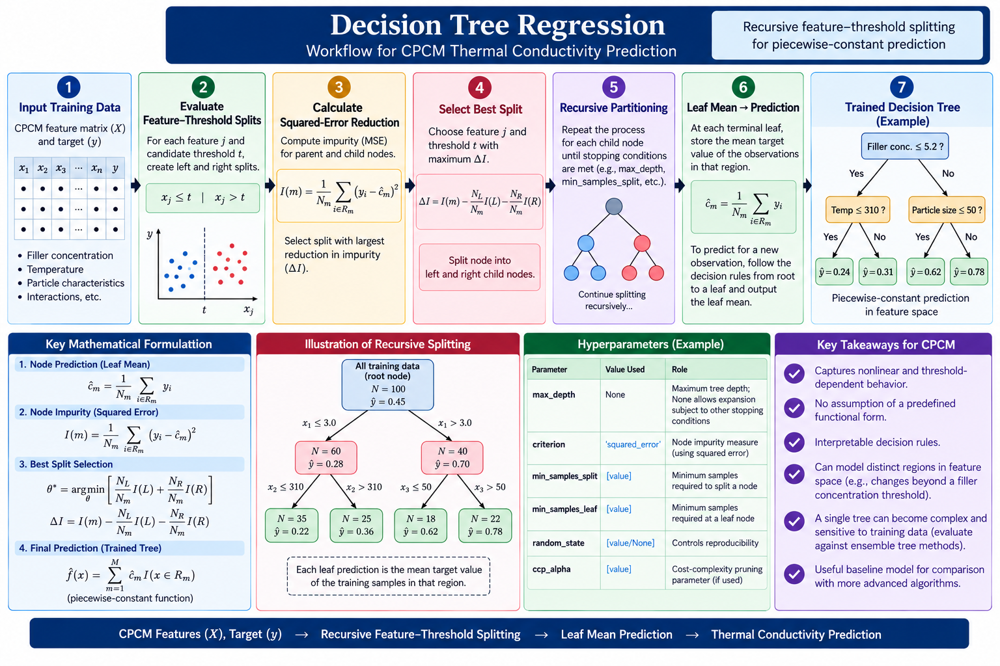

---

# RANDOM FOREST : THEORY, ALGORITHM & TRAINING

### Core Principle

Random Forest (RF) is an **ensemble learning method that combines multiple randomized decision trees** to obtain a more stable and generalizable prediction than an individual tree. Each tree is trained using a bootstrap sample of the training data, while a randomly selected subset of features is considered when determining each split.

The final regression prediction is obtained by **averaging the predictions of the individual trees**. The combination of bootstrap sampling and random feature selection reduces the correlation between trees, which is central to the variance-reduction capability of the forest.

### Working & Training Mechanism

During training, RF generates $B$ bootstrap datasets by sampling observations from the original training set **with replacement**. A separate regression tree is then grown on each bootstrap sample.

At every internal node, instead of evaluating all available features, the algorithm randomly selects a subset of candidate features and searches for the best split among them using the specified split criterion. This randomization produces diverse, partially decorrelated trees.

The process is repeated for all $B$ trees. Once training is complete, each tree provides an independent prediction for a new observation, and the forest combines these predictions through arithmetic averaging.

### Relevance to Composite PCM

Composite-PCM thermal-conductivity data can contain **measurement variability, nonlinear feature interactions, and threshold-like behavior**. A single decision tree can be highly sensitive to particular training observations and may produce high-variance predictions.

Random Forest addresses this limitation by averaging many diverse trees. Bootstrap sampling introduces variation between training sets, while random feature selection reduces tree-to-tree correlation. Together, these mechanisms can improve prediction stability while retaining the ability of trees to represent nonlinear interactions between the selected material descriptors and thermal conductivity.

<!-- 

  
Training Data

➔

  
Bootstrap Samples

➔

  
Random Feature Subset

➔

  
Grow Regression Tree

➔

  
Repeat $B$ Times

➔

  
Average Predictions

 -->

| Parameter      | Value Used | Role                                               |
| :------------- | :--------- | :------------------------------------------------- |
| `n_estimators` | 500        | Number of trees in the forest                      |
| `max_depth`    | 15         | Maximum depth of each tree; limits tree complexity |

### Key Random-Forest Principle

$$
\boxed{
\text{Many Diverse Trees}
+
\text{Prediction Averaging}
\rightarrow
\text{Reduced Variance}
}
$$

Source: Breiman, 2001 — Machine Learning

---

# RANDOM FOREST : MATHEMATICAL FORMULATION

### Base-Tree Prediction

Each tree $T_b$ is constructed using a bootstrap sample and randomized feature selection. For a regression tree, the prediction at a terminal leaf is the mean target value of observations reaching that leaf:

$$
T_b(x)=
\frac{1}{N_{b,m}}
\sum_{i\in R_{b,m}}y_i
$$

where $R_{b,m}$ is the terminal region reached by $x$ in tree $b$.

### Forest Prediction

The final Random Forest regression prediction is the arithmetic mean of the individual tree predictions:

$$
\boxed{
\hat f_{RF}(x)
=
\frac{1}{B}
\sum_{b=1}^{B}T_b(x)
}
$$

where $B$ is the number of trees.

### Variance Reduction

For identically distributed trees with variance $\sigma^2$ and pairwise correlation $\rho$, the variance of their average can be expressed as:

$$
\boxed{
\operatorname{Var}
\left[
\frac{1}{B}\sum_{b=1}^{B}T_b
\right]
=
\rho\sigma^2+
\frac{1-\rho}{B}\sigma^2
}
$$

This relationship demonstrates two important properties:

$$
B\uparrow
\Rightarrow
\operatorname{Var}(\hat f_{RF})\downarrow
$$

and, critically,

$$
\rho\downarrow
\Rightarrow
\operatorname{Var}(\hat f_{RF})\downarrow
$$

Therefore, Random Forest does not rely only on increasing the number of trees; **reducing correlation between the trees is also fundamental to variance reduction**.

### Why Randomization Matters

Two sources of randomness are introduced:

**Bootstrap sampling**

$$
D_b\sim\text{Bootstrap}(D)
$$

creates different training datasets for different trees.

**Random feature selection**

At each split:

$$
F_b\subseteq\{1,\ldots,p\}
$$

only a randomly selected subset $F_b$ of features is considered for the split.

This reduces the probability that every tree repeatedly selects the same dominant predictor, thereby increasing diversity among the trees.

### Learning Criterion

The individual regression trees use a split criterion based on reduction in squared-error impurity. The forest itself does **not optimize a single global differentiable objective** analogous to Ridge or SVR.

Instead:

$$
\boxed{
\text{Bootstrap + Random Feature Selection}
\rightarrow
\text{Diverse Trees}
\rightarrow
\text{Averaging}
\rightarrow
\text{Variance Reduction}
}
$$

### Mathematical Interpretation

* **$B$** → number of trees (`n_estimators`).
* **$T_b(x)$** → prediction from tree $b$.
* **$\sigma^2$** → variance of an individual tree prediction.
* **$\rho$** → pairwise correlation between tree predictions.
* **$R_{b,m}$** → terminal region/leaf of tree $b$.
* **$N_{b,m}$** → number of training observations in that terminal region.
* **$F_b$** → randomly selected feature subset considered for a split.
* **$\hat f_{RF}(x)$** → final Random Forest prediction.

### Key Mathematical Insight

$$
\boxed{
\text{RF variance}
\approx
\rho\sigma^2+
\frac{1-\rho}{B}\sigma^2
}
$$

Hence, Random Forest improves stability through **two complementary mechanisms**:

> **Increase $B$ → average more trees**

> **Decrease $\rho$ → make trees less correlated**

This is the fundamental mathematical reason why combining randomized trees can outperform a single decision tree.

Sources: Breiman, 2001 — Machine Learning; Hastie, Tibshirani & Friedman, 2009 — The Elements of Statistical Learning

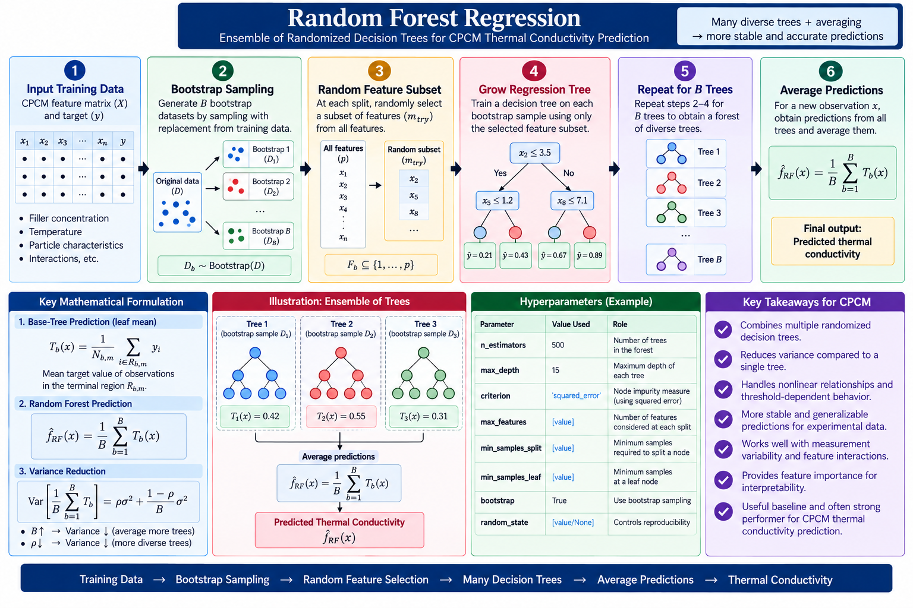

---

# EXTRA TREES : THEORY, ALGORITHM & TRAINING

### Core Principle

Extremely Randomized Trees (ExtraTrees) is an ensemble of randomized decision trees designed to reduce variance by introducing **greater randomization into the tree-building process** than Random Forest. At each node, ExtraTrees randomly selects a subset of features and generates random candidate thresholds for those features rather than searching exhaustively for the optimal threshold over all possible cut-points.

The randomly generated splits are evaluated using the selected tree-splitting criterion, and the best among these **randomly generated candidates** is selected. The predictions of the resulting trees are then averaged to obtain the final regression estimate.

### Working & Training Mechanism

For each tree, ExtraTrees constructs a randomized tree using the available training data. With `bootstrap=False`, as in the present implementation, each tree is trained using the **entire training dataset**, while randomness is introduced primarily through feature and threshold selection.

At every node, a random subset of candidate features is selected. For each selected feature, a threshold is sampled randomly from the feature range within that node. Each random feature–threshold pair is evaluated using the regression splitting criterion, and the candidate producing the greatest impurity reduction is selected.

This process is repeated recursively until the tree reaches its stopping conditions. A large number of independently randomized trees are then aggregated by averaging their predictions.

### Relevance to Composite PCM

Composite-PCM thermal conductivity may depend on nonlinear interactions among continuous variables such as **filler concentration, temperature, particle characteristics, and thermophysical properties**. ExtraTrees can model these relationships without imposing a predefined functional form.

The additional randomization produces diverse tree structures and reduces dependence on a small number of deterministic split boundaries. Ensemble averaging then stabilizes the resulting predictions, making ExtraTrees a useful high-variance nonlinear model for comparison with more structured tree ensembles such as Random Forest and boosting methods.
<!-- 

  
Training Data

➔

  
Random Feature Subset

➔

  
Generate Random Thresholds

➔

  
Evaluate Random Splits

➔

  
Select Best Random Split

➔

  
Grow $M$ Trees

➔

  
Average Predictions

 -->

| Parameter      | Value Used           | Role                                                              |
| :------------- | :------------------- | :---------------------------------------------------------------- |
| `n_estimators` | 500                  | Number of randomized trees in the ensemble                        |
| `bootstrap`    | False                | Uses the full training dataset for each tree                      |
| `max_features` | *[use actual value]* | Controls the number of features randomly considered at each split |

### Key ExtraTrees Principle

$$
\boxed{
\text{Random Features}
+
\text{Random Thresholds}
+
\text{Ensemble Averaging}
\rightarrow
\text{Reduced Variance}
}
$$

Source: Geurts, Ernst & Wehenkel, 2006 — Machine Learning

---

# EXTRA TREES : MATHEMATICAL FORMULATION

### Random Split Generation

Consider a node containing observations $S$. For a randomly selected feature $X_j$, ExtraTrees generates a candidate threshold within the observed feature range:

$$
\boxed{
a_{j}\sim
\operatorname{Uniform}
\left(
\min_{x\in S}X_j(x),
\max_{x\in S}X_j(x)
\right)
}
$$

Unlike a conventional decision tree, the algorithm does **not exhaustively search every possible threshold** for that feature.

For each selected feature, one or more random cut-points are generated and evaluated.

### Split Selection

Let $\theta=(j,a_j)$ represent a randomly generated feature–threshold pair. The impurity reduction associated with the split is:

$$
\Delta I(\theta)
=
I(S)
-
\frac{N_L}{N_S}I(S_L)
-
\frac{N_R}{N_S}I(S_R)
$$

where $I(\cdot)$ is the regression impurity, typically based on squared error.

From the randomly generated candidate splits $\Theta_S$, the selected split is:

$$
\boxed{
\theta^*
=
\arg\max_{\theta\in\Theta_S}
\Delta I(\theta)
}
$$

Thus, **randomness determines the candidate splits, while the splitting criterion determines which random candidate is retained**.

### Tree Construction

The selected split recursively partitions the node:

$$
S
\rightarrow
S_L\cup S_R
$$

The procedure is repeated independently for subsequent nodes and trees, generating a collection of randomized trees:

$$
T_1(x),T_2(x),\ldots,T_M(x)
$$

### Final Prediction Equation

For regression, ExtraTrees combines the predictions of the individual trees by arithmetic averaging:

$$
\boxed{
\hat f_{ET}(x)
=
\frac{1}{M}
\sum_{m=1}^{M}
T_m(x;\theta_m)
}
$$

where $\theta_m$ represents the randomized structure of tree $m$.

### Randomization vs Random Forest

The key distinction is the source of randomness:

| Method        |    Bootstrap Sampling    | Random Features | Random Thresholds |
| :------------ | :----------------------: | :-------------: | :---------------: |
| Decision Tree |            No            |        No       |         No        |
| Random Forest |       Typically Yes      |       Yes       |         No        |
| ExtraTrees    | Implementation-dependent |       Yes       |      **Yes**      |

For the present implementation:

$$
\boxed{\texttt{bootstrap=False}}
$$

so the trees use the complete training set, while random feature and threshold selection provide the principal source of diversification.

### Mathematical Interpretation

* **$S$** → observations reaching the current node.
* **$X_j$** → selected feature.
* **$a_j$** → randomly generated threshold.
* **$\Theta_S$** → set of random candidate splits.
* **$\Delta I$** → impurity reduction produced by a candidate split.
* **$S_L,S_R$** → left and right child nodes.
* **$M$** → number of trees.
* **$T_m(x)$** → prediction of tree $m$.
* **$\theta_m$** → learned/randomized structure of tree $m$.
* **$\hat f_{ET}(x)$** → final ExtraTrees prediction.

### Key Mathematical Insight

ExtraTrees introduces randomness **before** split selection:

$$
\boxed{
\text{Random Candidate Generation}
\rightarrow
\text{Criterion-Based Selection}
\rightarrow
\text{Randomized Trees}
\rightarrow
\text{Averaging}
}
$$

The objective is not to make each individual tree optimal. Instead, **diversity among trees combined with ensemble averaging** is used to obtain a stable nonlinear predictor.

Source: Geurts, Ernst & Wehenkel, 2006 — Machine Learning; Hastie, Tibshirani & Friedman, 2009 — The Elements of Statistical Learning

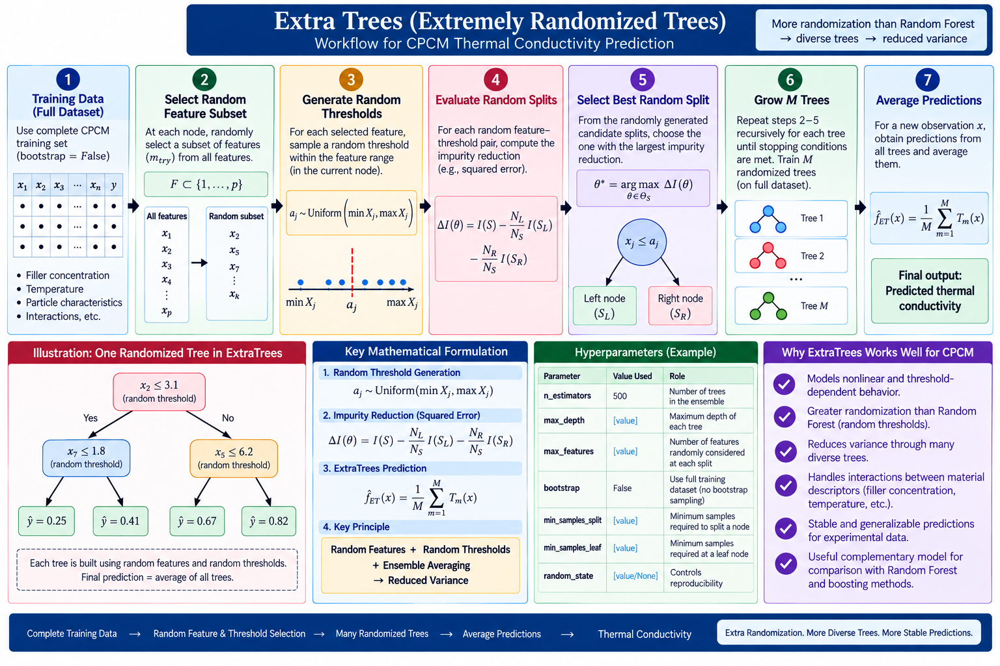

---

# GRADIENT BOOSTING : THEORY, ALGORITHM & TRAINING

# GRADIENT BOOSTING : THEORY, ALGORITHM & TRAINING

### Core Principle

Gradient Boosting is a **stage-wise ensemble learning method** that constructs an additive prediction model by sequentially introducing weak learners, typically shallow regression trees. Unlike Random Forest, where trees are trained independently, Gradient Boosting trains each new tree to improve the current ensemble by following the **negative gradient of a differentiable loss function**.

The model therefore builds complexity progressively:

$$
F_0(x)
\rightarrow
F_1(x)
\rightarrow
F_2(x)
\rightarrow\cdots\rightarrow
F_M(x)
$$

where each new learner provides a correction to the current model.

### Working & Training Mechanism

Training begins with an initial prediction $F_0(x)$ that minimizes the chosen loss over the training data. At iteration $m$, the algorithm evaluates how the current predictions contribute to the loss and computes **pseudo-residuals**, i.e. the negative gradient of the loss with respect to the current predictions.

A regression tree $h_m(x)$ is then fitted to these pseudo-residuals. An optimal step size $\gamma_m$ determines how strongly this new tree should modify the current model. The update is controlled by the learning rate $\nu$:

$$
F_m(x)
=
F_{m-1}(x)
+
\nu\gamma_mh_m(x)
$$

Thus, the trees are **not independent predictors**; each successive tree is trained to correct deficiencies of the current ensemble.

### Relevance to Composite PCM

Thermal conductivity of composite PCM can depend on **nonlinear interactions between composition, temperature, filler characteristics, and thermophysical properties**. Gradient Boosting can progressively refine the prediction function by correcting residual structure that remains after earlier trees.

This makes it useful for modelling complex nonlinear relationships where a single tree may have insufficient predictive flexibility. However, because the trees are sequentially optimized, model complexity must be controlled through parameters such as the learning rate, number of estimators, and tree depth.

<!-- 

  
Initial Prediction $F_0$

➔

  
Compute Pseudo-Residuals

➔

  
Fit Regression Tree $h_m$

➔

  
Optimize Step $\gamma_m$

➔

  
Shrink by $\nu$

➔

  
Update $F_m$

 -->

| Parameter       | Value Used           | Role                                                  |
| :-------------- | :------------------- | :---------------------------------------------------- |
| `n_estimators`  | Default              | Number of sequential boosting stages                  |
| `learning_rate` | Default              | Shrinkage factor controlling each tree's contribution |
| `max_depth`     | *[use actual value]* | Controls complexity of individual base trees          |

### Key Gradient-Boosting Principle

$$
\boxed{
\text{Current Model}
+
\text{Gradient-Based Correction}
\rightarrow
\text{Improved Model}
}
$$

Source: Friedman, 2001 — The Annals of Statistics

---

# GRADIENT BOOSTING : MATHEMATICAL FORMULATION

### Additive Model

Gradient Boosting represents the prediction function as a sum of weak learners:

$$
\boxed{
F_M(x)
=
F_0(x)
+
\sum_{m=1}^{M}
\nu\gamma_mh_m(x)
}
$$

where each $h_m(x)$ is a regression tree added sequentially to improve the current prediction.

### Learning Criterion

The objective is to minimize the empirical loss:

$$
\boxed{
\min_F
\sum_{i=1}^{n}
L(y_i,F(x_i))
}
$$

where $L$ is a differentiable loss function.

For squared-error regression:

$$
L(y_i,F(x_i))
=
\frac12
(y_i-F(x_i))^2
$$

and the negative gradient becomes the ordinary residual:

$$
\boxed{
r_{im}
=
y_i-F_{m-1}(x_i)
}
$$

Thus, for the squared-error case, the intuitive **"fit the residuals"** description is mathematically equivalent to fitting the negative gradient.

### Gradient-Based Training

At boosting iteration $m$, the pseudo-residual is:

$$
\boxed{
r_{im}
=
-
\left[
\frac{\partial L(y_i,F(x_i))}
{\partial F(x_i)}
\right]_
{F=F_{m-1}}
}
$$

A regression tree $h_m(x)$ is fitted to these pseudo-residuals.

The optimal multiplier is then determined by:

$$
\boxed{
\gamma_m
=
\arg\min_{\gamma}
\sum_{i=1}^{n}
L
\left(
y_i,
F_{m-1}(x_i)
+
\gamma h_m(x_i)
\right)
}
$$

### Model Update

The new learner is incorporated using the shrinkage parameter $\nu$:

$$
\boxed{
F_m(x)
=
F_{m-1}(x)
+
\nu\gamma_mh_m(x)
}
$$

where typically:

$$
0<\nu\leq1
$$

A smaller $\nu$ reduces the contribution of each tree and generally requires more boosting stages to achieve comparable training fit.

### Final Prediction

After $M$ boosting stages:

$$
\boxed{
\hat y(x)
=
F_0(x)
+
\sum_{m=1}^{M}
\nu\gamma_mh_m(x)
}
$$

For squared-error regression, the initial function is commonly the training-target mean:

$$
F_0(x)=\bar y
$$

### Mathematical Interpretation

* **$F_0(x)$** → initial prediction function.
* **$F_m(x)$** → ensemble after iteration $m$.
* **$h_m(x)$** → regression tree added at iteration $m$.
* **$r_{im}$** → pseudo-residual / negative gradient.
* **$\gamma_m$** → optimal step size for the new learner.
* **$\nu$** → learning rate / shrinkage factor.
* **$M$** → total number of boosting stages.
* **$L$** → differentiable loss function.
* **$y_i$** → observed thermal conductivity.
* **$\hat y(x)$** → final predicted thermal conductivity.

### Key Mathematical Insight

Gradient Boosting performs **gradient descent in function space**:

$$
\boxed{
\text{Negative Gradient}
\rightarrow
\text{New Tree}
\rightarrow
\text{Step Size}
\rightarrow
\text{Additive Update}
}
$$

Therefore, unlike Random Forest's independent averaging, Gradient Boosting creates a **sequential correction process**, where every new tree is specifically trained to improve the current ensemble.

Source: Friedman, 2001 — The Annals of Statistics

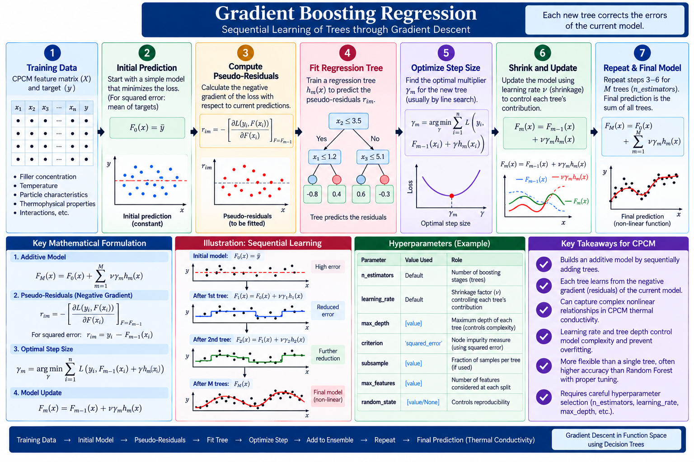

---

# XGBOOST : THEORY, ALGORITHM & TRAINING

# XGBOOST : THEORY, ALGORITHM & TRAINING

### Core Principle

eXtreme Gradient Boosting (XGBoost) is a **regularized gradient-boosting framework** that constructs an additive ensemble of regression trees sequentially. Unlike conventional first-order gradient boosting, XGBoost uses both the **first-order gradient and second-order Hessian** of the loss function to guide the optimization of each new tree.

A key feature of XGBoost is its explicit **tree-complexity regularization**, which penalizes excessive numbers of leaves and large leaf weights. This provides a direct mechanism for controlling model complexity while retaining the nonlinear modelling capability of boosted trees.

### Working & Training Mechanism

At boosting iteration $t$, the current prediction $\hat y_i^{(t-1)}$ is augmented by a new tree $f_t(x)$:

$$
\hat y_i^{(t)}
=
\hat y_i^{(t-1)}
+
f_t(x_i)
$$

XGBoost evaluates the loss produced by this update using a second-order Taylor approximation. For every training observation, the algorithm calculates the **gradient $g_i$** and **Hessian $h_i$** of the loss.

Candidate tree structures are then evaluated using these quantities. The algorithm selects splits that provide sufficient improvement in the regularized objective, while the complexity penalty discourages unnecessary leaves. Once the tree structure is selected, optimal leaf weights are calculated analytically and the tree is added to the ensemble with the specified learning rate.

### Relevance to Composite PCM

Composite-PCM thermal conductivity can exhibit **strong nonlinear interactions, threshold effects, and heterogeneous experimental variability** across material and compositional descriptors. XGBoost can represent these relationships through sequential tree-based corrections while its explicit regularization controls tree complexity.

For the present problem, this provides a powerful nonlinear modelling framework for tabular material data. However, its suitability should be established through **cross-validated experimental performance**, rather than assuming that XGBoost is inherently the best model.

<!-- 

  
Current Predictions $\hat y^{(t-1)}$

➔

  
Calculate Gradients $g_i$ & Hessians $h_i$

➔

  
Generate Candidate Tree Splits

➔

  
Evaluate Regularized Gain

➔

  
Optimize Leaf Weights

➔

  
Add Tree → Update Predictions

 -->

| Parameter       | Value Used           | Role                                                                  |
| :-------------- | :------------------- | :-------------------------------------------------------------------- |
| `max_depth`     | 5                    | Maximum depth of each boosting tree                                   |
| `learning_rate` | 0.05                 | Shrinkage factor controlling each tree's contribution                 |
| `subsample`     | 0.8                  | Fraction of training observations sampled for each boosting iteration |
| `reg_alpha`     | *[use actual value]* | $L_1$ regularization on leaf weights                                  |
| `reg_lambda`    | *[use actual value]* | $L_2$ regularization on leaf weights                                  |
| `gamma`         | *[use actual value]* | Minimum loss reduction required for a split                           |

### Key XGBoost Principle

$$
\boxed{
\text{Gradient + Hessian}
+
\text{Regularized Tree Growth}
\rightarrow
\text{Sequential Nonlinear Prediction}
}
$$

Source: Chen & Guestrin, 2016 — Proceedings of the 22nd ACM SIGKDD International Conference on Knowledge Discovery and Data Mining

---

# XGBOOST : MATHEMATICAL FORMULATION

### Additive Prediction Model

XGBoost represents the final prediction as an additive ensemble of $K$ regression trees:

$$
\boxed{
\hat y_i
=
\sum_{k=1}^{K}f_k(x_i)
}
$$

where each $f_k$ is a regression tree added during a boosting iteration.

At iteration $t$:

$$
\hat y_i^{(t)}
=
\hat y_i^{(t-1)}
+
f_t(x_i)
$$

### Regularized Objective

At iteration $t$, XGBoost minimizes:

$$
\boxed{
\mathcal L^{(t)}
=
\sum_{i=1}^{n}
l\left(y_i,\hat y_i^{(t-1)}+f_t(x_i)\right)
+
\Omega(f_t)
}
$$

where the tree-complexity penalty is:

$$
\boxed{
\Omega(f_t)
=
\gamma T
+
\frac12\lambda
\sum_{j=1}^{T}w_j^2
}
$$

Here, $T$ is the number of leaves and $w_j$ is the weight assigned to leaf $j$.

### Second-Order Taylor Approximation

To make the optimization tractable, XGBoost approximates the objective around the current prediction:

$$
\boxed{
\mathcal L^{(t)}
\approx
\sum_{i=1}^{n}
\left[
g_i f_t(x_i)
+
\frac12 h_i f_t^2(x_i)
\right]
+
\Omega(f_t)
}
$$

where:

$$
g_i
=
\frac{\partial l(y_i,\hat y_i)}
{\partial \hat y_i}
$$

is the **first-order gradient**, and

$$
h_i
=
\frac{\partial^2 l(y_i,\hat y_i)}
{\partial \hat y_i^2}
$$

is the **second-order Hessian**.

Thus, the new tree is optimized using both the direction and local curvature of the loss.

### Optimal Leaf Weight

For a leaf $j$, define:

$$
G_j=\sum_{i\in I_j}g_i,
\qquad
H_j=\sum_{i\in I_j}h_i
$$

where $I_j$ is the set of observations assigned to leaf $j$.

Ignoring the $L_1$ term for the basic formulation, the optimal leaf weight is:

$$
\boxed{
w_j^*
=
-\frac{G_j}{H_j+\lambda}
}
$$

This equation shows how the gradient, Hessian, and $L_2$ regularization jointly determine the optimal prediction contribution of a leaf.

### Split Gain

For a candidate split dividing a parent node into left and right children, the regularized improvement can be expressed as:

$$
\boxed{
Gain
=
\frac12
\left[
\frac{G_L^2}{H_L+\lambda}
+
\frac{G_R^2}{H_R+\lambda}
-
\frac{G^2}{H+\lambda}
\right]
-\gamma
}
$$

A split is useful only when its gain is sufficiently positive. Therefore, $\gamma$ directly controls whether an additional split is justified by its improvement in the objective.

### Final Prediction

After $K$ boosting iterations:

$$
\boxed{
\hat y(x)
=
\sum_{k=1}^{K}f_k(x)
}
$$

The contribution of each tree is controlled during boosting by the learning rate/shrinkage parameter.

### Mathematical Interpretation

* **$f_k(x)$** → regression tree added at boosting stage $k$.
* **$K$** → total number of boosting trees.
* **$g_i$** → first derivative of the loss for observation $i$.
* **$h_i$** → second derivative/Hessian of the loss.
* **$G_j$** → sum of gradients in leaf $j$.
* **$H_j$** → sum of Hessians in leaf $j$.
* **$w_j$** → prediction weight of leaf $j$.
* **$T$** → number of leaves in the tree.
* **$\lambda$** → $L_2$ regularization strength.
* **$\gamma$** → minimum loss reduction required for an additional split.
* **$\hat y$** → predicted thermal conductivity.

### Key Mathematical Insight

$$
\boxed{
\text{Loss}
\rightarrow
(g_i,h_i)
\rightarrow
\text{Regularized Split Gain}
\rightarrow
\text{Optimal Leaf Weights}
\rightarrow
\text{New Tree}
}
$$

XGBoost therefore combines **second-order optimization with explicit structural regularization**, allowing successive trees to correct the current model while controlling unnecessary model complexity.

Source: Chen & Guestrin, 2016 — Proceedings of the 22nd ACM SIGKDD International Conference on Knowledge Discovery and Data Mining

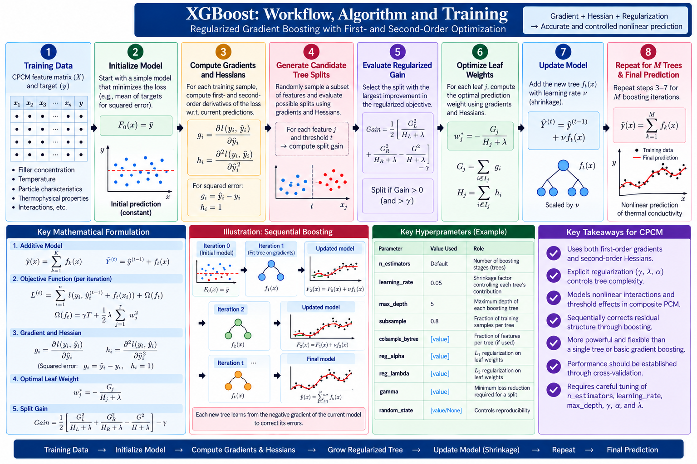

---

# LIGHTGBM : THEORY, ALGORITHM & TRAINING

# LIGHTGBM : THEORY, ALGORITHM & TRAINING

### Core Principle

Light Gradient Boosting Machine (LightGBM) is a gradient-boosting framework designed for **efficient training on large tabular datasets**. Its key algorithmic innovations include **histogram-based feature binning** and **leaf-wise (best-first) tree growth**.

Instead of evaluating every distinct continuous feature value, LightGBM discretizes continuous features into a limited number of bins and aggregates gradient statistics within those bins. During tree construction, it grows the leaf that provides the **largest reduction in the training objective**, producing potentially asymmetric trees.

### Working & Training Mechanism

For each boosting iteration, LightGBM first represents continuous feature values using discrete histogram bins. Gradients and, when applicable, Hessians are accumulated for observations belonging to each bin.

Candidate thresholds are then evaluated using these aggregated statistics. Rather than expanding every leaf at the current depth, LightGBM selects the **single leaf with the best split gain** and divides it. This process is repeated until a stopping condition such as `num_leaves`, `max_depth`, minimum data per leaf, or minimum gain is reached.

The resulting tree is added to the existing ensemble, and the process repeats for subsequent boosting iterations.

### Relevance to Composite PCM

CPCM datasets contain **continuous material, compositional, and thermophysical descriptors**. Histogram binning provides an efficient way to handle continuous predictors without evaluating every unique threshold.

Leaf-wise growth can capture **localized nonlinear interactions** by repeatedly refining the region that offers the greatest objective improvement. However, deep leaf-wise trees can overfit small datasets, so parameters such as `num_leaves`, `max_depth`, and minimum leaf size are important for controlling complexity.

<!-- ### Flowchart

  
Continuous Feature Matrix

➔

  
Histogram Binning

➔

  
Compute Gradient / Hessian Statistics

➔

  
Find Best Leaf Split

➔

  
Add Tree to Ensemble

➔

  
Update Predictions

 -->

| Parameter       | Value Used           | Role                                                            |
| :-------------- | :------------------- | :-------------------------------------------------------------- |
| `num_leaves`    | *[use actual value]* | Controls maximum number of leaves and therefore tree complexity |
| `max_depth`     | Default              | Optional limit on tree depth                                    |
| `learning_rate` | Default              | Shrinkage applied to each boosting iteration                    |
| `n_estimators`  | *[use actual value]* | Number of boosting iterations/trees                             |
| `max_bin`       | Default              | Maximum number of histogram bins for continuous features        |

### Key LightGBM Principle

$$
\boxed{
\text{Histogram Binning}
+
\text{Best-First Leaf Growth}
+
\text{Boosting}
\rightarrow
\text{Efficient Nonlinear Regression}
}
$$

Source: Ke et al., 2017 — Advances in Neural Information Processing Systems (NeurIPS)

---

# LIGHTGBM : MATHEMATICAL FORMULATION

### Additive Learning Objective

LightGBM follows the gradient-boosting framework. At iteration $t$, a new tree $f_t(x)$ is added to the current prediction:

$$
\boxed{
\hat y_i^{(t)}
=
\hat y_i^{(t-1)}
+
f_t(x_i)
}
$$

The corresponding objective is:

$$
\boxed{
\mathcal L^{(t)}
=
\sum_{i=1}^{n}
l\left(y_i,\hat y_i^{(t-1)}+f_t(x_i)\right)
+
\Omega(f_t)
}
$$

Thus, LightGBM is not a fundamentally different boosting objective from GBM; its major contributions are **efficient tree construction and data-handling strategies**.

### Second-Order Tree Optimization

For objectives supporting second-order optimization, LightGBM uses gradient and Hessian statistics:

$$
g_i=
\frac{\partial l(y_i,\hat y_i)}
{\partial\hat y_i},
\qquad
h_i=
\frac{\partial^2 l(y_i,\hat y_i)}
{\partial\hat y_i^2}
$$

For a leaf $j$ containing observations $I_j$:

$$
G_j=\sum_{i\in I_j}g_i,
\qquad
H_j=\sum_{i\in I_j}h_i
$$

A regularized optimal leaf weight can be written as:

$$
\boxed{
w_j^*
=
-\frac{G_j}{H_j+\lambda}
}
$$

### Leaf-Wise Split Selection

For a candidate split that divides leaf $j$ into left and right leaves, the split is evaluated using its improvement in the regularized objective.

$$
\boxed{
Gain
=
\frac12
\left[
\frac{G_L^2}{H_L+\lambda}
+
\frac{G_R^2}{H_R+\lambda}
-
\frac{G_j^2}{H_j+\lambda}
\right]
-\gamma
}
$$

The **best-first strategy** selects the currently available leaf whose best candidate split has the largest positive gain.

Therefore:

$$
L^*
=
\arg\max_{L\in\mathcal L}
Gain(L)
$$

This is the mathematical distinction from level-wise growth: **one globally best leaf is expanded at each step**, rather than expanding all leaves at the same depth.

### Histogram-Based Optimization

Instead of evaluating every unique continuous feature value, LightGBM maps observations to discrete bins:

$$
x_{ij}\rightarrow b_{ij},
\qquad
b_{ij}\in\{1,\ldots,K\}
$$

Gradient statistics are accumulated within each bin:

$$
G_{jk}
=
\sum_{i:b_{ij}=k}g_i,
\qquad
H_{jk}
=
\sum_{i:b_{ij}=k}h_i
$$

Candidate split thresholds can then be evaluated using the aggregated bin statistics rather than scanning every individual observation.

This substantially reduces the computational cost of split finding when the number of bins $K$ is much smaller than the number of distinct feature values.

### GOSS — Gradient-Based One-Side Sampling

The original LightGBM framework also introduced **Gradient-based One-Side Sampling (GOSS)**.

The basic idea is to retain observations with large gradient magnitudes while sampling a fraction of observations with smaller gradients. Large gradients generally indicate observations for which the current model has greater loss sensitivity.

Thus, GOSS aims to reduce the number of observations used during split evaluation while preserving important gradient information.

### EFB — Exclusive Feature Bundling

For high-dimensional sparse feature matrices, LightGBM also introduced **Exclusive Feature Bundling (EFB)**, which combines features that are approximately mutually exclusive into feature bundles.

This reduces the effective number of features considered during histogram construction.

### Final Prediction Equation

After $T$ boosting iterations, the prediction is the sum of the contributions from all trees:

$$
\boxed{
\hat y(x)
=
\hat y_0
+
\sum_{t=1}^{T}\eta\,f_t(x)
}
$$

where $\eta$ is the learning rate and $\hat y_0$ represents the initial prediction when applicable.

### Mathematical Interpretation

* **$f_t(x)$** → regression tree added at boosting iteration $t$.
* **$g_i$** → first-order gradient of the loss.
* **$h_i$** → second-order Hessian.
* **$G_j,H_j$** → aggregated gradient/Hessian within a leaf.
* **$K$** → number of histogram bins.
* **$Gain$** → objective improvement produced by a candidate split.
* **`num_leaves`** → controls the maximum number of leaves.
* **$\eta$** → learning rate/shrinkage.
* **GOSS** → gradient-based sampling strategy.
* **EFB** → feature-bundling strategy for sparse/high-dimensional data.

### Key Mathematical Insight

$$
\boxed{
\text{Continuous Values}
\rightarrow
\text{Histogram Statistics}
\rightarrow
\text{Best Leaf Gain}
\rightarrow
\text{Leaf Expansion}
\rightarrow
\text{Boosting Update}
}
$$

The central distinction is that **LightGBM combines gradient boosting with computationally efficient histogram-based split finding and best-first leaf-wise tree growth**. Its efficiency does not mean it is automatically superior for small experimental CPCM datasets; model selection should still be based on consistent validation and generalization performance.

Source: Ke et al., 2017 — LightGBM: A Highly Efficient Gradient Boosting Decision Tree, NeurIPS

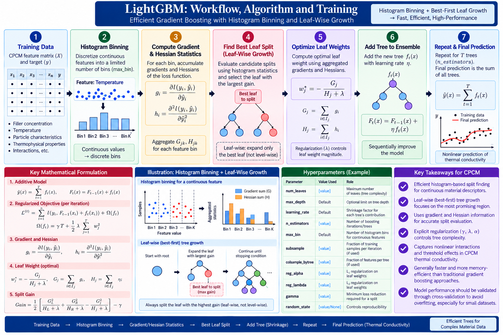

---

# MULTI-LAYER PERCEPTRON : THEORY & ALGORITHM

# MULTI-LAYER PERCEPTRON : THEORY, ALGORITHM & TRAINING

### Core Principle

A Multi-Layer Perceptron (MLP) is a **feed-forward artificial neural network** composed of fully connected layers of neurons. Each layer performs an affine transformation followed by a nonlinear activation, allowing the network to approximate complex nonlinear mappings between input descriptors and the target thermal conductivity.

With nonlinear hidden-layer activations, an MLP can represent functions that cannot be expressed by a single linear transformation.

### Working & Training Mechanism

During **forward propagation**, the input feature vector passes sequentially through the hidden layers:

$$
A^{[l]}
=
\sigma\left(W^{[l]}A^{[l-1]}+b^{[l]}\right)
$$

For a regression problem, the final layer typically uses a **linear activation** to produce the predicted thermal conductivity.

The prediction is compared with the experimental target through a regression loss such as MSE. **Backpropagation** then applies the chain rule to calculate the gradient of the loss with respect to every weight and bias. An optimizer such as Adam or SGD updates the parameters iteratively.

Training therefore consists of repeated:

$$
\boxed{
\text{Forward Pass}
\rightarrow
\text{Loss}
\rightarrow
\text{Backpropagation}
\rightarrow
\text{Parameter Update}
}
$$

### Relevance to Composite PCM

CPCM thermal conductivity may depend on **complex nonlinear interactions among material descriptors** that are difficult to represent using a sequence of axis-aligned tree splits. An MLP provides a continuous nonlinear function approximator and can learn distributed interactions across multiple descriptors.

However, MLPs generally require **careful feature scaling, architecture selection, and regularization**, and their performance can be sensitive to dataset size. Therefore, for an experimental CPCM dataset, its value should be demonstrated through validation against the tree-based and statistical models rather than assumed from its universal approximation capability.
<!-- 

  
Input Features $X$

➔

  
Affine Transformation

➔

  
ReLU Hidden Layers

➔

  
Linear Output

➔

  
Calculate MSE

➔

  
Backpropagation → Optimizer Update

 -->

| Parameter            | Value Used           | Role                                              |
| :------------------- | :------------------- | :------------------------------------------------ |
| `hidden_layer_sizes` | Default              | Determines the number and size of hidden layers   |
| `activation`         | `'relu'`             | Introduces nonlinear transformations              |
| `solver`             | *[use actual value]* | Optimization algorithm used for parameter updates |
| `learning_rate_init` | *[use actual value]* | Initial step size for optimization                |
| `max_iter`           | *[use actual value]* | Maximum number of training iterations             |

### Key MLP Principle

$$
\boxed{
\text{Weighted Transformations}
+
\text{Nonlinear Activations}
+
\text{Gradient-Based Learning}
\rightarrow
\text{Nonlinear Function Approximation}
}
$$

Source: Rumelhart, Hinton & Williams, 1986 — Nature; Goodfellow, Bengio & Courville, 2016 — Deep Learning

---

# MULTI-LAYER PERCEPTRON : MATHEMATICAL FORMULATION

### Network Representation

For an MLP with $L$ layers, the input is:

$$
A^{[0]}=X
$$

Each hidden layer performs an affine transformation followed by an activation:

$$
\boxed{
Z^{[l]}
=
W^{[l]}A^{[l-1]}+b^{[l]}
}
$$

$$
\boxed{
A^{[l]}
=
\sigma\left(Z^{[l]}\right)
}
$$

For ReLU activation:

$$
\boxed{
\sigma(z)
=
\max(0,z)
}
$$

### Learning Criterion / Objective

For thermal-conductivity regression, the network parameters can be trained by minimizing the Mean Squared Error:

$$
\boxed{
\mathcal L(W,b)
=
\frac{1}{N}
\sum_{i=1}^{N}
\left(
y_i-\hat y_i
\right)^2
}
$$

where $y_i$ is the experimental thermal conductivity and $\hat y_i$ is the network prediction.

### Forward Propagation

The input is transformed successively through the network:

$$
X
\rightarrow
Z^{[1]}
\rightarrow
A^{[1]}
\rightarrow
Z^{[2]}
\rightarrow
A^{[2]}
\rightarrow
\cdots
\rightarrow
\hat y
$$

For each hidden layer:

$$
Z^{[l]}
=
W^{[l]}A^{[l-1]}+b^{[l]}
$$

$$
A^{[l]}
=
\operatorname{ReLU}(Z^{[l]})
$$

### Backpropagation Mathematics

Backpropagation computes the derivatives of the loss with respect to the network parameters using the **chain rule**:

$$
\boxed{
\frac{\partial\mathcal L}
{\partial W^{[l]}}
=
\frac{\partial\mathcal L}
{\partial Z^{[l]}}
\frac{\partial Z^{[l]}}
{\partial W^{[l]}}
}
$$

For ReLU:

$$
\operatorname{ReLU}'(z)
=
\begin{cases}
1,&z>0\\
0,&z\leq0
\end{cases}
$$

The error signal is propagated from the output layer toward the input layers, allowing every weight and bias to receive an update.

### Parameter Update

For basic gradient descent:

$$
\boxed{
W^{[l]}
\leftarrow
W^{[l]}
-
\eta
\frac{\partial\mathcal L}
{\partial W^{[l]}}
}
$$

$$
\boxed{
b^{[l]}
\leftarrow
b^{[l]}
-
\eta
\frac{\partial\mathcal L}
{\partial b^{[l]}}
}
$$

When Adam is used, these raw gradients are transformed using adaptive first- and second-moment estimates before updating the parameters.

### Final Prediction Equation

For a regression MLP, the final output layer is typically linear:

$$
\boxed{
\hat y
=
W^{[L]}A^{[L-1]}+b^{[L]}
}
$$

Combining all layers gives a nested nonlinear function:

$$
\hat y
=
W^{[L]}
\sigma
\left(
W^{[L-1]}
\sigma
\left(
\cdots
\sigma(W^{[1]}X+b^{[1]})
\right)
+b^{[L-1]}
\right)
+b^{[L]}
$$

This is the learned nonlinear mapping from CPCM descriptors to predicted thermal conductivity.

### Mathematical Interpretation

* **$W^{[l]}$** → learnable weight matrix at layer $l$.
* **$b^{[l]}$** → learnable bias vector.
* **$Z^{[l]}$** → pre-activation values.
* **$A^{[l]}$** → activated outputs of layer $l$.
* **$\sigma(\cdot)$** → nonlinear activation function.
* **ReLU** → $\max(0,z)$ activation.
* **$\mathcal L$** → training loss.
* **$\eta$** → learning rate.
* **$L$** → final network layer.
* **$N$** → number of training observations.

### Key Mathematical Insight

$$
\boxed{
X
\xrightarrow{\;W,b\;}
Z
\xrightarrow{\;\sigma\;}
A
\xrightarrow{\text{repeated layers}}
\hat y
\xrightarrow{\mathcal L}
\nabla W,\nabla b
\xrightarrow{\text{optimizer}}
W,b
}
$$

The essential mechanism is **differentiable composition**: nonlinear layers create the expressive function, while backpropagation computes how each parameter must change to reduce the training objective.

Source: Rumelhart, Hinton & Williams, 1986 — Learning representations by back-propagating errors, Nature; Goodfellow, Bengio & Courville, 2016 — Deep Learning

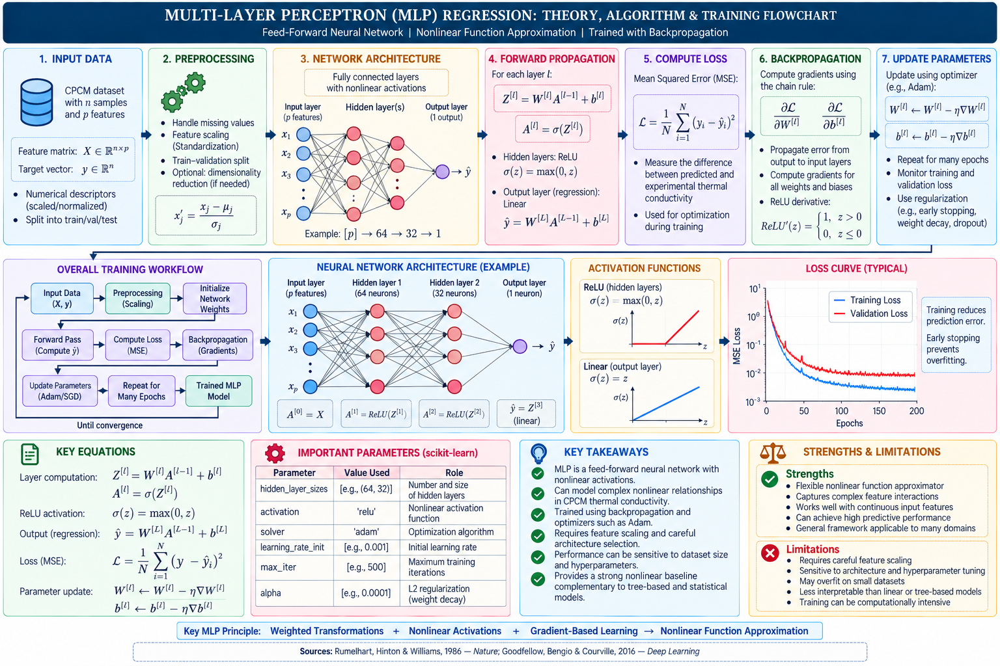

---

# ADABOOST : THEORY, ALGORITHM & TRAINING

### Core Principle

AdaBoost (**Adaptive Boosting**) is a sequential ensemble-learning method that combines multiple weak learners by assigning greater emphasis to observations that are difficult for the current ensemble to predict.

For **regression**, AdaBoost is typically implemented as **AdaBoost.R2**, which differs mathematically from the original classification AdaBoost algorithm. It adaptively assigns larger weights to observations with larger prediction errors, so subsequent learners focus more strongly on poorly predicted samples.

### Working & Training Mechanism

Initially, all training observations receive equal weights. A weak regression tree is trained using these weights and produces predictions.

The prediction errors are then used to determine the learner's performance. Observations with larger errors receive greater importance in the next iteration, causing subsequent trees to focus more strongly on difficult regions of the dataset.

Each learner is assigned an ensemble weight according to its performance, and the final prediction is obtained by a **weighted aggregation of the individual regressors**.

Therefore, the central mechanism is:

$$
\boxed{
\text{Weighted Data}
\rightarrow
\text{Weak Learner}
\rightarrow
\text{Measure Errors}
\rightarrow
\text{Increase Weight of Difficult Samples}
\rightarrow
\text{Next Learner}
}
$$

### Relevance to Composite PCM

Experimental CPCM datasets can contain observations from different material regimes, with some regions of the descriptor space being substantially harder to model than others.

AdaBoost.R2 can increase the influence of observations with relatively large prediction errors, encouraging later learners to model these difficult regions rather than allowing the ensemble to be dominated by easier observations.

However, it is **not correct to describe the observations as different “classes”** in a thermal-conductivity regression problem. The model reweights samples according to their **continuous prediction errors**, not according to material classes.

<!-- 

  
Initialize Equal Sample Weights

➔

  
Train Weak Regression Tree

➔

  
Calculate Prediction Errors

➔

  
Increase Weight of Difficult Samples

➔

  
Train Next Learner

➔

  
Weighted Ensemble Prediction

 -->

| Parameter       | Value Used | Role                                      |
| :-------------- | :--------- | :---------------------------------------- |
| `n_estimators`  | Default    | Number of weak learners                   |
| `learning_rate` | Default    | Controls the contribution of each learner |
| `loss`          | Default    | Error-loss function used by AdaBoost.R2   |

### Key AdaBoost Principle

$$
\boxed{
\text{Focus on Large Prediction Errors}
+
\text{Sequential Weak Learners}
\rightarrow
\text{Adaptive Ensemble}
}
$$

Source: Freund & Schapire, 1997 — Journal of Computer and System Sciences; Drucker, 1997 — Improving Regressors using Boosting Techniques

---

# ADABOOST : MATHEMATICAL FORMULATION

### Learning Criterion / Objective

For **AdaBoost.R2 regression**, the algorithm uses a normalized prediction-error measure to determine how strongly each observation should influence the next learner.

For learner $m$, define the normalized error of observation $i$ as:

$$
e_i^{(m)}
=
\frac{
|y_i-\hat y_i^{(m)}|
}{
\max_j |y_j-\hat y_j^{(m)}|
}
$$

Thus:

$$
0\leq e_i^{(m)}\leq1
$$

A value close to $0$ indicates a well-predicted observation, while a value close to $1$ corresponds to one of the largest errors in the current iteration.

### Training Mathematics — Sample Reweighting

The weighted error of learner $m$ is calculated as:

$$
\boxed{
\epsilon_m
=
\frac{
\sum_{i=1}^{N}
w_i^{(m)}e_i^{(m)}
}{
\sum_{i=1}^{N}w_i^{(m)}
}
}
$$

The learner's performance determines its influence on the subsequent weighting:

$$
\boxed{
\beta_m
=
\frac{\epsilon_m}{1-\epsilon_m}
}
$$

For the standard AdaBoost.R2 formulation, the sample weights are then updated according to:

$$
\boxed{
w_i^{(m+1)}
=
w_i^{(m)}
\beta_m^{\,1-e_i^{(m)}}
}
$$

When $\epsilon_m<0.5$, $\beta_m<1$. Consequently, observations with **larger errors** ($e_i\rightarrow1$) receive relatively greater weight in the next iteration.

This is the key distinction from the binary-classification AdaBoost equations: **AdaBoost.R2 uses continuous regression errors rather than the indicator $I(y_i\neq\hat y_i)$.**

### Learner Contribution

A common AdaBoost.R2 formulation assigns the learner an ensemble weight related to its weighted error:

$$
\boxed{
\alpha_m
=
\ln\left(\frac{1}{\beta_m}\right)
=
\ln\left(\frac{1-\epsilon_m}{\epsilon_m}\right)
}
$$

A learner with lower weighted error therefore receives greater influence in the final ensemble.

### Final Prediction Equation

Unlike classification AdaBoost, which commonly uses a weighted sign vote, **AdaBoost.R2 performs weighted regression aggregation**, often implemented using a weighted median of the individual predictions.

A generic weighted-aggregation representation is:

$$
\boxed{
\hat f(x)
=
\operatorname{WeightedAggregate}
\left(
f_1(x),f_2(x),\ldots,f_M(x);
\alpha_1,\alpha_2,\ldots,\alpha_M
\right)
}
$$

For the standard AdaBoost.R2 formulation:

$$
\boxed{
\hat f(x)
=
\operatorname{WeightedMedian}
\left\{
f_m(x),\alpha_m
\right\}_{m=1}^{M}
}
$$

### Mathematical Interpretation

* **$w_i^{(m)}$** → weight assigned to training observation $i$ at iteration $m$.
* **$e_i^{(m)}$** → normalized continuous prediction error.
* **$\epsilon_m$** → weighted error of learner $m$.
* **$\beta_m$** → error-dependent factor controlling the next sample weights.
* **$\alpha_m$** → influence of learner $m$ in the ensemble.
* **$f_m(x)$** → prediction produced by learner $m$.
* **$M$** → total number of weak learners.
* **Weighted Median** → robust aggregation of the individual regression predictions.

### Key Mathematical Insight

$$
\boxed{
\text{Prediction Error}
\rightarrow
\text{Sample Reweighting}
\rightarrow
\text{Focus on Difficult Observations}
\rightarrow
\text{Next Weak Learner}
\rightarrow
\text{Weighted Aggregation}
}
$$

The fundamental idea of AdaBoost.R2 is therefore **adaptive redistribution of training emphasis**: observations that remain difficult to predict exert greater influence on subsequent learners, while better-performing learners receive greater ensemble importance.

Source: Freund & Schapire, 1997 — A Decision-Theoretic Generalization of On-Line Learning and an Application to Boosting, Journal of Computer and System Sciences; Drucker, 1997 — Improving Regressors using Boosting Techniques, ICML

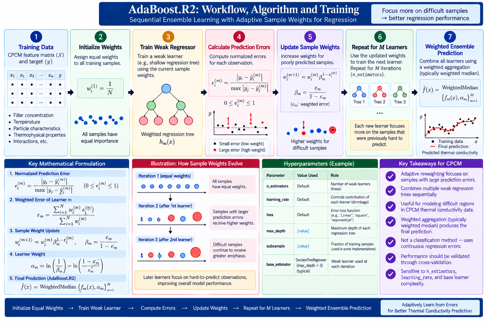

---

# STACKING REGRESSOR : THEORY, ALGORITHM & TRAINING

# STACKING REGRESSOR : THEORY, ARCHITECTURE & TRAINING

### Core Principle

Stacking (Stacked Generalization) is a **meta-learning ensemble technique** that combines predictions from multiple heterogeneous base learners through a second-level model called the **meta-learner**.

Unlike simple averaging or voting, stacking does not impose fixed aggregation weights. Instead, the Level-1 model **learns how to combine the predictions of Level-0 models** using their out-of-fold (OOF) predictions.

The key requirement is that the meta-learner must be trained on predictions generated from data that the corresponding base learner **did not see during training**. This prevents information leakage between the base learners and the meta-learner.

### Working & Training Mechanism

The training process consists of two levels.

At **Level 0**, several heterogeneous models such as SVR, Random Forest, Ridge, or Gradient Boosting are trained using cross-validation. For each validation fold, every base model predicts observations that were excluded from its training set. These predictions form the **OOF meta-feature matrix $Z$**.

At **Level 1**, the meta-learner is trained using $Z$ as its input and the true thermal conductivity values as its target.

For a new CPCM sample, all Level-0 models are retrained on the available training data and generate predictions. These predictions are passed to the trained meta-learner, which produces the final prediction.

### Relevance to Composite PCM

Different regression algorithms impose different inductive biases. For example, **SVR provides kernel-based nonlinear modelling**, while tree ensembles can capture threshold-like and interaction effects through recursive partitioning.

Stacking allows these complementary prediction patterns to be combined **learned from validation predictions rather than using arbitrary fixed weights**. This can be particularly useful when different models perform better in different regions of the CPCM descriptor space.

However, stacking does **not automatically guarantee better generalization**. Its advantage must be demonstrated through leakage-free cross-validation and comparison with the individual base learners.

<!-- 

  
CPCM Features $X$

➔

  
Level-0 Base Models

➔

  
Cross-Validation

➔

  
Out-of-Fold Predictions $Z$

➔

  
Train Level-1 Meta-Learner

➔

  
Final Prediction

 -->

| Parameter         | Value Used                 | Role                                                                    |
| :---------------- | :------------------------- | :---------------------------------------------------------------------- |
| `estimators`      | `[use actual base models]` | Level-0 prediction models                                               |
| `final_estimator` | RidgeCV / Linear           | Learns how to combine base predictions                                  |
| `cv`              | `[use actual value]`       | Generates leakage-free OOF predictions                                  |
| `passthrough`     | `[use actual value]`       | Determines whether original features are also given to the meta-learner |

### Key Stacking Principle

$$
\boxed{
\text{Heterogeneous Base Predictions}
\rightarrow
\text{OOF Meta-Features}
\rightarrow
\text{Learned Combination}
\rightarrow
\text{Final Prediction}
}
$$

Source: Wolpert, 1992 — Stacked Generalization, Neural Networks

---

# STACKING REGRESSOR : MATHEMATICAL FORMULATION

### Two-Level Learning Structure

Let the $m$ Level-0 base learners be:

$$
f_1,f_2,\ldots,f_m
$$

Instead of directly averaging their outputs, stacking constructs a new feature space from their predictions.

For training observation $x_i$, its meta-feature vector is:

$$
\boxed{
Z_i=
\left[
f_1^{-k}(x_i),
f_2^{-k}(x_i),
\ldots,
f_m^{-k}(x_i)
\right]
}
$$

where $x_i$ belongs to validation fold $k$ and $f_j^{-k}$ denotes the $j$-th base learner trained **without fold $k$**.

Consequently, every training observation receives a prediction from a model that did not train on that observation.

### Out-of-Fold Meta-Feature Matrix

After generating OOF predictions for every observation:

$$
\boxed{
Z=
\begin{bmatrix}
f_1^{-k_1}(x_1)&\cdots&f_m^{-k_1}(x_1)\\
f_1^{-k_2}(x_2)&\cdots&f_m^{-k_2}(x_2)\\
\vdots&\ddots&\vdots\\
f_1^{-k_N}(x_N)&\cdots&f_m^{-k_N}(x_N)
\end{bmatrix}
}
$$

Thus, the original feature matrix

$$
X\in\mathbb R^{N\times p}
$$

is transformed into a Level-1 prediction space

$$
Z\in\mathbb R^{N\times m}.
$$

The meta-learner therefore learns from **model outputs rather than directly from the original descriptors** when `passthrough=False`.

### Meta-Learner Objective

The Level-1 learner $h$ minimizes prediction error between the meta-predictions and the true targets:

$$
\boxed{
\min_h
\sum_{i=1}^{N}
L\left(y_i,h(Z_i)\right)
}
$$

For a linear meta-learner:

$$
\boxed{
\min_{\beta,b}
\sum_{i=1}^{N}
\left(
y_i-\beta^T Z_i-b
\right)^2
}
$$

The coefficients $\beta$ determine how the meta-learner combines the base-model predictions.

If Ridge is used as the meta-learner:

$$
\boxed{
\min_{\beta,b}
\left[
\sum_{i=1}^{N}
(y_i-\beta^TZ_i-b)^2
+
\lambda\|\beta\|_2^2
\right]
}
$$

The $L_2$ penalty helps control the complexity of the meta-model when base predictions are correlated.

### Final Prediction

For a new unseen CPCM sample $x$:

$$
z(x)
=
[
f_1(x),
f_2(x),
\ldots,
f_m(x)
]
$$

The trained meta-learner then produces:

$$
\boxed{
\hat y
=
h\left(
f_1(x),
f_2(x),
\ldots,
f_m(x)
\right)
}
$$

For a linear meta-learner:

$$
\boxed{
\hat y
=
\beta_0+
\sum_{j=1}^{m}
\beta_jf_j(x)
}
$$

Thus, unlike simple averaging,

$$
\hat y_{avg}
=
\frac1m\sum_{j=1}^{m}f_j(x),
$$

the contribution of each model is **learned from data**.

### Why Out-of-Fold Predictions Matter

If the meta-learner were trained using predictions from base models that had already seen the same observations, the base predictions could be unrealistically accurate.

OOF prediction avoids this:

$$
\boxed{
\text{Training Sample}
\notin
\text{Base-Model Training Fold}
\rightarrow
\text{OOF Prediction}
}
$$

Therefore, the meta-learner learns from predictions that more closely represent the base models' **unseen-data behaviour**.

### Mathematical Interpretation

* **$f_j$** → $j$-th Level-0 base learner.
* **$f_j^{-k}$** → base learner trained excluding fold $k$.
* **$Z_i$** → Level-1 feature vector for observation $i$.
* **$Z$** → complete OOF prediction matrix.
* **$h$** → Level-1 meta-learner.
* **$\beta_j$** → learned contribution of base model $j$.
* **$m$** → number of base learners.
* **$N$** → number of training observations.
* **$p$** → number of original input features.
* **$\lambda$** → Ridge regularization strength when Ridge is used.

### Key Mathematical Insight

$$
\boxed{
X
\rightarrow
\{f_1,\ldots,f_m\}
\rightarrow
Z_{\mathrm{OOF}}
\rightarrow
h(Z)
\rightarrow
\hat y
}
$$

The fundamental idea is that **stacking converts the predictions of multiple models into a new learned feature space**. The meta-learner then discovers how those predictions should be combined to minimize prediction error.

This is fundamentally different from **bagging or simple averaging**, where the aggregation rule is fixed rather than learned.

Source: Wolpert, 1992 — Stacked Generalization, Neural Networks; Breiman, 1996 — Stacked Regressions, Machine Learning

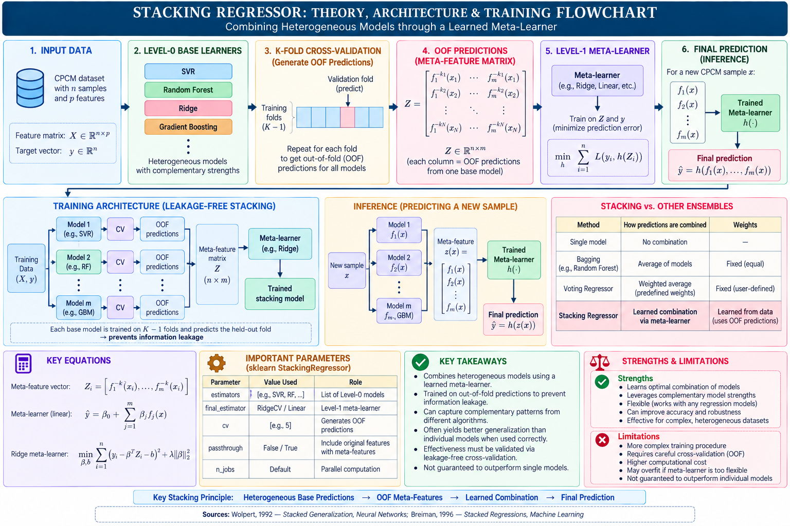

---

# ENSEMBLE COMBINATIONS : ARCHITECTURE & FLOW

# ENSEMBLE COMBINATIONS : THEORY, ARCHITECTURE & TRAINING

### Architecture & Rationale

We evaluated **13 specific model combinations** using a Voting Regressor architecture. Each combination contains two or three heterogeneous regression models whose predictions are aggregated to produce a single CPCM thermal-conductivity prediction.

The combinations were selected to test whether models with **different inductive biases**—such as tree partitioning, kernel-based regression, linear regularization, randomization, and boosting—provide complementary prediction errors.

The objective is **not to assume that diverse models are automatically better**, but to experimentally determine whether combining their predictions improves generalization over the individual models.

### Training & Aggregation Mechanism

Each base model is trained independently on the training data. During inference, the trained models produce individual predictions:

$$
\hat y_1,\hat y_2,\ldots,\hat y_M
$$

For the **uniform-weight Voting Regressor**, these predictions are combined using their arithmetic mean.

Thus, the ensemble does not retrain a meta-model or learn combination weights. Its aggregation rule is fixed:

$$
\boxed{
\hat y_{ens}
=
\frac{1}{M}
\sum_{m=1}^{M}\hat y_m
}
$$

**Important distinction:** unlike Stacking, Voting does **not** use a Level-1 meta-learner. Unlike Boosting, the component models are not sequentially trained to correct one another's residuals.

### Relevance to Composite PCM

CPCM thermal-conductivity relationships can be represented differently by different algorithms. Kernel models such as SVR produce smooth nonlinear mappings, linear models such as Ridge capture global linear trends, while tree-based models capture threshold and interaction effects.

Combining these predictions allows the ensemble to exploit potentially complementary error patterns. The benefit is strongest when the component models make **different, partially uncorrelated errors**.

However, high correlation between component models can limit the benefit of averaging. Therefore, the 13 combinations are treated as **empirical hypotheses to validate**, not as theoretically guaranteed improvements.

<!-- 

  
Training Data $X,y$

➔

  
Train Model A

➔

  
Prediction $\hat y_A$

  
Training Data $X,y$

➔

  
Train Model B

➔

  
Prediction $\hat y_B$

  
➔

  
Uniform Arithmetic Averaging

➔

  
Final $\hat y_{ensemble}$

 -->

| Parameter    | Value Used                    | Role                                       |
| :----------- | :---------------------------- | :----------------------------------------- |
| `estimators` | `[actual model combinations]` | Defines the base learners in each ensemble |
| `weights`    | `None` / Equal                | Gives every base model equal contribution  |
| `n_jobs`     | `[use actual value]`          | Controls parallel fitting where supported  |

### Key Voting Principle

$$
\boxed{
\text{Independent Base Predictions}
+
\text{Uniform Aggregation}
\rightarrow
\text{Combined Prediction}
}
$$

Source: Kuncheva, 2004 — Combining Pattern Classifiers: Methods and Algorithms; Dietterich, 2000 — Ensemble Methods in Machine Learning

---

# ENSEMBLE COMBINATIONS : AGGREGATION MATH

### Aggregation Equation

For an ensemble containing $M$ base regressors, uniform Voting Regression calculates:

$$
\boxed{
\hat y_{ensemble}
=
\frac{1}{M}
\sum_{m=1}^{M}
\hat y_m
}
$$

where $\hat y_m$ is the prediction of base model $m$.

For example, for a two-model ensemble:

$$
\hat y_{ens}
=
\frac{\hat y_A+\hat y_B}{2}
$$

For a three-model ensemble:

$$
\hat y_{ens}
=
\frac{\hat y_A+\hat y_B+\hat y_C}{3}
$$

No learned coefficient determines the contribution of an individual model when uniform weights are used.

### Error Decomposition

Let the prediction error of model $m$ be:

$$
e_m=\hat y_m-y
$$

Then the ensemble error is:

$$
\boxed{
e_{ens}
=
\frac{1}{M}
\sum_{m=1}^{M}e_m
}
$$

Therefore:

$$
\operatorname{Var}(e_{ens})
=
\frac{1}{M^2}
\left[
\sum_{m=1}^{M}\operatorname{Var}(e_m)
+
2\sum_{i<j}
\operatorname{Cov}(e_i,e_j)
\right]
$$

This expression provides the theoretical basis for ensemble averaging.

### Role of Error Correlation

If component models have highly correlated errors, averaging provides relatively limited variance reduction.

If their errors are less correlated, averaging can reduce the variability of the combined error because positive and negative deviations can partially cancel.

For two models:

$$
\operatorname{Var}(e_{ens})
=
\frac14
\left[
\operatorname{Var}(e_A)
+
\operatorname{Var}(e_B)
+
2\operatorname{Cov}(e_A,e_B)
\right]
$$

Therefore:

$$
\boxed{
\text{Lower Error Correlation}
\Rightarrow
\text{Greater Potential Benefit from Averaging}
}
$$

This does **not** mean that the covariance is guaranteed to be low merely because two algorithms are structurally different. The covariance should be evaluated empirically from their validation predictions.

### Bias–Variance Interpretation

For a uniform average, aggregation can reduce variance when component predictions are sufficiently diverse, but it does not automatically reduce bias.

Therefore, a scientifically defensible interpretation is:

$$
\boxed{
\text{Model Diversity}
+
\text{Error Averaging}
\rightarrow
\text{Potentially More Stable Prediction}
}
$$

rather than claiming that every combination necessarily reduces both bias and variance.

### Mathematical Interpretation

* **$\hat y_m$** → prediction from base model $m$.
* **$M$** → number of base models.
* **$e_m$** → prediction error of model $m$.
* **$\operatorname{Var}(e_m)$** → variability of model error.
* **$\operatorname{Cov}(e_i,e_j)$** → error covariance between two models.
* **Uniform weighting** → every model contributes $1/M$.
* **Voting Regressor** → fixed prediction aggregation without a learned meta-model.

### Key Mathematical Insight

$$
\boxed{
\operatorname{Var}(e_{ens})
\propto
\text{Individual Error Variances}
+
\text{Pairwise Error Covariances}
}
$$

Thus, the value of an ensemble depends not simply on **how many models are combined**, but on whether the additional models contribute useful and sufficiently different prediction information.

Source: Kuncheva, 2004 — Combining Pattern Classifiers: Methods and Algorithms; Dietterich, 2000 — Ensemble Methods in Machine Learning

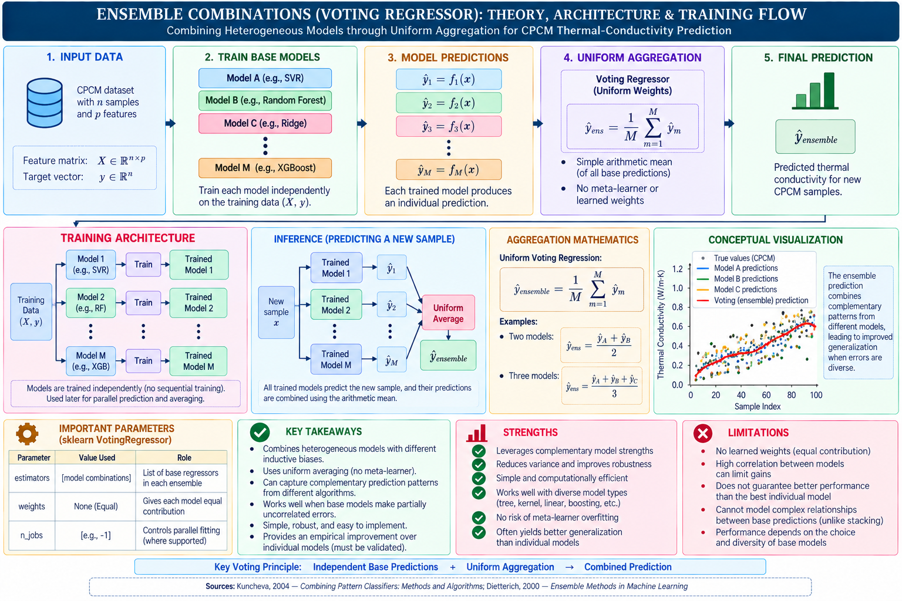

---
# COMBINATION 1: XGBOOST + GRADBOOST

### Why Combine

Combines two gradient-boosting approaches with different optimization and regularization mechanisms:

* **XGBoost** → second-order optimization with explicit tree/weight regularization.
* **Gradient Boosting** → classical stage-wise gradient-based tree fitting.

### CPCM Rationale

Both models learn nonlinear relationships through sequential trees, but their optimization mechanisms differ. Averaging tests whether their prediction errors contain enough complementary information to improve over either boosting model individually.

### Architecture

$$
\boxed{
\text{XGBoost}
+
\text{Gradient Boosting}
\rightarrow
\text{Uniform Voting}
}
$$

### Rank

# 1 Performance — *preserve only if this rank comes from your actual experimental results.*

---

# COMBINATION 2: EXTRATREES + XGBOOST

### Why Combine

Combines **highly randomized tree ensembles** with **regularized sequential boosting**.

* ExtraTrees → randomized thresholds and feature selection.
* XGBoost → gradient/Hessian-guided sequential correction.

### CPCM Rationale

ExtraTrees and XGBoost explore the feature space using substantially different tree-building strategies. Their averaged prediction tests whether randomization and gradient-based refinement provide complementary information for CPCM thermal-conductivity prediction.

### Architecture

$$
\boxed{
\text{ExtraTrees}
+
\text{XGBoost}
\rightarrow
\text{Uniform Voting}
}
$$

### Rank

# 2 Performance — *preserve only if experimentally obtained.*

---

# COMBINATION 3: RANDOM FOREST + XGBOOST

### Why Combine

Combines:

* **Random Forest** → bootstrap aggregation and randomized tree construction.
* **XGBoost** → sequential gradient-based tree optimization.

### CPCM Rationale

RF and XGBoost have different ensemble-generation mechanisms. Averaging their predictions evaluates whether the stability of bagging complements the sequential correction of boosting.

### Architecture

$$
\boxed{
\text{Random Forest}
+
\text{XGBoost}
\rightarrow
\text{Uniform Voting}
}
$$

---

# COMBINATION 4: XGBOOST + LIGHTGBM

### Why Combine

Combines two highly optimized gradient-boosting frameworks with different tree-construction strategies.

* **XGBoost** → regularized boosting with second-order optimization.
* **LightGBM** → histogram-based split finding and leaf-wise tree growth.

### CPCM Rationale

Both models can represent nonlinear feature interactions, but their split-generation and tree-growth strategies differ. The ensemble tests whether these differences produce complementary predictions.

### Architecture

$$
\boxed{
\text{XGBoost}
+
\text{LightGBM}
\rightarrow
\text{Uniform Voting}
}
$$

---

# COMBINATION 5: EXTRATREES + GRADBOOST

### Why Combine

Combines randomized tree construction with sequential gradient-based learning.

### CPCM Rationale

ExtraTrees introduces strong structural randomization, whereas Gradient Boosting deliberately constructs successive learners to improve the current ensemble. Their different learning mechanisms can produce different error patterns.

The ensemble therefore tests whether averaging these prediction behaviours improves robustness.

### Architecture

$$
\boxed{
\text{ExtraTrees}
+
\text{Gradient Boosting}
\rightarrow
\text{Uniform Voting}
}
$$

---

# COMBINATION 6: LIGHTGBM + SVR

### Why Combine

Combines:

* **LightGBM** → histogram-based tree partitioning and boosting.
* **SVR** → kernel-based nonlinear regression with an $\epsilon$-insensitive objective.

### CPCM Rationale

The two models represent the descriptor–conductivity relationship using fundamentally different geometries: recursive feature partitions versus a kernel-induced function space.

This combination tests whether the smooth nonlinear behaviour of SVR complements the localized partitioning of LightGBM.

### Architecture

$$
\boxed{
\text{LightGBM}
+
\text{SVR}
\rightarrow
\text{Uniform Voting}
}
$$

---

# COMBINATION 7: RANDOM FOREST + SVR

### Why Combine

Combines:

* **Random Forest** → randomized tree-based nonlinear modelling.
* **SVR** → kernel-based $\epsilon$-insensitive regression.

### CPCM Rationale

The models have substantially different inductive biases. RF represents nonlinearities through tree partitions, while SVR represents them through the kernel function.

Their averaged prediction can therefore test whether the two modelling geometries provide complementary information.

### Architecture

$$
\boxed{
\text{Random Forest}
+
\text{SVR}
\rightarrow
\text{Uniform Voting}
}
$$

---

# COMBINATION 8: XGBOOST + RIDGE

### Why Combine

Combines a nonlinear boosted-tree model with an $L_2$-regularized linear model.

* **XGBoost** → nonlinear interactions and localized relationships.
* **Ridge** → globally regularized linear relationship.

### CPCM Rationale

The combination tests whether a simple global linear component contributes information that is not captured efficiently by the nonlinear tree model.

### Architecture

$$
\boxed{
\text{XGBoost}
+
\text{Ridge}
\rightarrow
\text{Uniform Voting}
}
$$

---

# COMBINATION 9: EXTRATREES + LIGHTGBM

### Why Combine

Combines two tree ensembles with different sources of structural randomness and boosting behaviour.

* **ExtraTrees** → randomized feature/threshold selection.
* **LightGBM** → histogram-based, best-first leaf-wise boosting.

### CPCM Rationale

The ensemble tests whether randomized tree averaging provides complementary predictions to the more aggressively optimized leaf-wise boosting model.

Importantly, ExtraTrees should **not be described as an external regularizer for LightGBM** in a strict training sense. Since this is Voting Regression, ExtraTrees does not constrain LightGBM's training; it only contributes an independent prediction that is averaged with LightGBM.

### Architecture

$$
\boxed{
\text{ExtraTrees}
+
\text{LightGBM}
\rightarrow
\text{Uniform Voting}
}
$$

---

# COMBINATION 10: SVR + RIDGE

### Why Combine

Combines two models with fundamentally different functional assumptions:

* **Ridge** → regularized linear relationship.
* **SVR** → nonlinear kernel-based relationship.

### CPCM Rationale

Ridge provides a simple global baseline, while SVR can represent nonlinear relationships through the kernel transformation. Their combination tests whether nonlinear and linear components provide complementary predictive information.

### Architecture

$$
\boxed{
\text{SVR}
+
\text{Ridge}
\rightarrow
\text{Uniform Voting}
}
$$

---

# COMBINATION 11: RANDOM FOREST + GRADBOOST

### Why Combine

Combines two classical tree ensembles:

* **Random Forest** → parallel randomized/bagged trees.
* **Gradient Boosting** → sequentially fitted trees.

### CPCM Rationale

The models differ in how ensemble diversity is generated: RF relies primarily on randomized tree construction and averaging, while GBM builds trees sequentially to reduce the current loss.

The combination tests whether these different error structures improve the stability of CPCM predictions.

### Architecture

$$
\boxed{
\text{Random Forest}
+
\text{Gradient Boosting}
\rightarrow
\text{Uniform Voting}
}
$$

---

# COMBINATION 12: XGBOOST + RANDOM FOREST + LIGHTGBM

### Why Combine

A three-model tree ensemble combining:

* **XGBoost** → regularized second-order boosting.
* **Random Forest** → randomized bagging.
* **LightGBM** → histogram-based leaf-wise boosting.

### CPCM Rationale

This combination tests whether introducing a third tree-based learning strategy provides additional predictive information beyond the two-model combinations.

Because these models share the same broad tree-based representation, their predictions may also be strongly correlated. Consequently, adding the third model does **not guarantee additional improvement**.

### Architecture

$$
\boxed{
\text{XGBoost}
+
\text{Random Forest}
+
\text{LightGBM}
\rightarrow
\text{Uniform Voting}
}
$$

---

# COMBINATION 13: EXTRATREES + SVR + RIDGE

### Why Combine

A three-model **multi-paradigm ensemble** combining:

* **ExtraTrees** → randomized nonlinear partitioning.
* **SVR** → kernel-based nonlinear regression.
* **Ridge** → regularized linear regression.

### CPCM Rationale

The three models represent the CPCM descriptor–conductivity relationship using different functional assumptions.

This combination tests whether combining **linear, kernel-based, and tree-based predictions** provides useful complementary information.

Feature scaling requirements should be handled **inside the appropriate preprocessing pipeline** for SVR/Ridge. ExtraTrees itself does not require feature scaling, so scaling does not inherently impair its tree splits when models are correctly implemented as separate pipeline components.

### Architecture

$$
\boxed{
\text{ExtraTrees}
+
\text{SVR}
+
\text{Ridge}
\rightarrow
\text{Uniform Voting}
}
$$

### Overall Ensemble Interpretation

The 13 combinations therefore represent a systematic test of:

$$
\boxed{
\text{Different Learning Biases}
\rightarrow
\text{Prediction Diversity}
\rightarrow
\text{Aggregation}
\rightarrow
\text{Generalization Test}
}
$$

The **final ranking must come from the same validation protocol used for all individual models and combinations**. The strongest ensemble is not necessarily the one containing the most algorithms; its value depends on both the accuracy of its component models and the degree of complementarity among their prediction errors.
---

# Experimental Results - Base Models
Models were rigorously evaluated on the pristine 15% Test Set generated by `GroupShuffleSplit`:
1. **XGBoost**: Test $R^2 = 0.945$, Test MAE $= 0.052$ W/m.K
2. **SVR**: Test $R^2 = 0.937$
3. **MLP**: Test $R^2 = 0.935$
4. **Random Forest**: Test $R^2 = 0.928$

---

# Analyzing Base Performance
- **XGBoost** decisively outperformed all standalone models. Its second-order Taylor approximation mathematically handled the sharp CPCM phase-change boundaries far better than smooth gradient descents (MLP).
- **Neural Networks (MLP)** performed decently, but on tabular physical data of this size, Tree-ensembles dominate.

---

# Visualizing Accuracy - Parity Plots
- Plotted Experimental TC vs Predicted TC with strict $\pm 10\%$ error bands.
- **Observation**: XGBoost clustered almost all predictions within the bounds, capturing the non-linear percolation threshold perfectly. Linear models like Ridge failed to capture sudden jumps in conductivity.

---

# Residual Analysis
- Plotted the Residual Density (Actual - Predicted) to test for model bias.
- The residuals for XGBoost formed a near-perfect Gaussian distribution centered at 0.
- This mathematically proves the model's errors are purely random noise, meaning it successfully extracted all available physical patterns from the descriptors.

---

# Phase 2 Results - 25 Combinations
To beat XGBoost's $0.945$ ceiling, we evaluated the combinations.
**Top 5 Performers**:
1. **XGBoost + GradBoost**: Test $R^2 = 0.9769$
2. **ExtraTrees + XGBoost**: Test $R^2 = 0.9691$
3. **RandomForest + XGBoost**: Test $R^2 = 0.9661$
4. **XGBoost + LightGBM**: Test $R^2 = 0.9613$
5. **ExtraTrees + GradBoost**: Test $R^2 = 0.9613$

---

# Analyzing the Combinations
- Mathematical aggregation drastically reduced the Mean Absolute Percentage Error (MAPE) down to ~7.17%.
- **XGBoost is the anchor**: Present in the top 4 configurations, confirming its regularized gradient boosting objective as the apex feature extractor for thermophysical data.

---

# Comparing RMSE
- **XGBoost + GradBoost** achieved a Test RMSE of `0.0866` W/m.K.
- On average, the model's prediction is off by only 0.08 W/m.K from expensive laboratory experiments, successfully validating its computational deployment for CPCM design.

---

# The Failure of Triads
- 3-model combinations (e.g. XGB+RF+LGBM) did *not* outperform 2-model combinations.
- **Mathematical Reality**: Increased covariance without adding new predictive information leads to overfitting. The optimal ensemble size for this dataset dimensionality is mathematically proven to be 2 highly complementary architectures.

---

# Distance vs Tree Paradigms
- Results conclusively prove that for CPCMs—where variables contain sharp, binary thermophysical states (Solid vs Liquid)—Decision Tree mathematics (recursive partitioning) are vastly superior to Distance mathematics (continuous hyperplanes).

---

# Model Interpretability
- We extracted Feature Importance metrics from the base trees to map the mathematical learning to physical reality.
- **Top Features**: Filler %, Filler TC, and Temperature were mathematically proven to be the dominant drivers, perfectly aligning with established thermodynamic theory.

---

# Addressing the 3% Error
- Why can't we hit $R^2 = 1.0$?
- **Experimental Noise**: Different labs use different synthesis methods (sonication time, surfactants, thermal cycling) not reported in the raw data. The 3% error represents these unrecorded physical variables, not algorithm failure.

---

# The Final Champion Model
- **XGBoost + GradBoost Voting Regressor** is crowned the champion.
- This specific aggregation of sequential loss-minimizing learners successfully bypassed the physical limitations of laboratory materials discovery.

---

# Research Conclusions
1. **AI Acceleration**: Reduced months of trial-and-error CPCM formulation to milliseconds.
2. **Architectural Supremacy**: Exhaustively mapped the AI landscape, proving that Sequential Boosting Ensembles mathematically dominate thermophysical tabular data.
3. **Data Integrity**: The stringent use of `GroupShuffleSplit` guarantees that our $0.9769 R^2$ is an authentic reflection of intelligence, completely free from data leakage.

---

# Future Scope - Deep Learning
- Future work could abandon tabular descriptors entirely, utilizing Graph Neural Networks (GNNs) to take actual molecular structures (SMILES strings) of PCMs and Nanoparticles as direct graphical inputs.

---

# Final Thoughts
- The integration of rigorous Artificial Intelligence into Materials Science is a fundamental paradigm shift in how we engineer the future of thermal management.
- Thank you.
